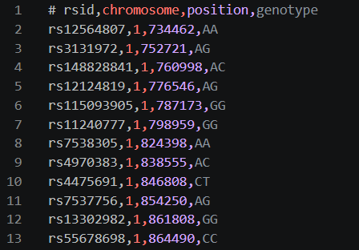
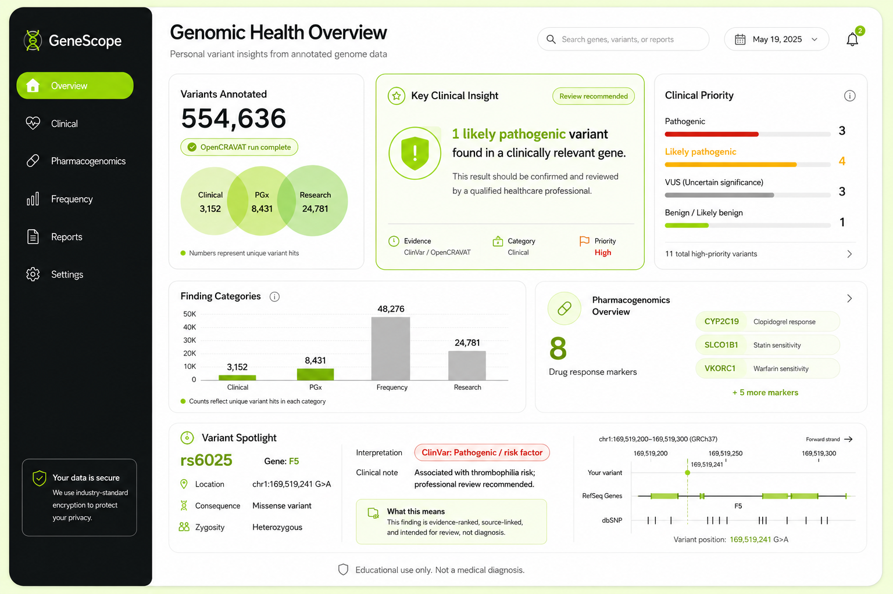

# Báo cáo tuần 1: Clinical Variant Analytics Dashboard

## A. Executive Summary + Week 1 Deliverables

### Tóm tắt điều hành

Tuần 1 tập trung xây dựng **research foundation**, **dataset validation** và **PoC evidence** cho Clinical Variant Analytics Dashboard. Kết quả chính là xác định được input phù hợp cho MVP, vai trò của các reference databases, hướng annotation pipeline, các artifact preprocessing đầu tiên và kế hoạch benchmark có thể đo được từ tuần tiếp theo.

MVP hướng tới một dashboard báo cáo biến thể gen có **citation-grounded reporting**, **traceability layer**, **HITL review gate** và **scope boundary** rõ ràng. Các milestone tiếp theo sẽ được track từ tuần 2 bằng benchmark/evaluation framework thay vì chỉ mô tả khảo sát.

### Week 1 Deliverables

| Status | Deliverable | Evidence / artifact | Ý nghĩa cho mentor review |
| --- | --- | --- | --- |
| ✅ | Dataset decision | Chọn consumer SNP file làm input chính; dùng Kaggle `Child 1 Genome.csv` và PGP `hu43860C`. | Có sample thật để test parser, build handling và annotation readiness. |
| ✅ | Reference database survey | Đã khảo sát dbSNP, ClinVar, gnomAD, GWAS Catalog, ClinPGx/PharmGKB, SNPedia, OMIM, ClinGen, LitVar. | Xác định vai trò từng source trong report thay vì gom chung thành một database. |
| ✅ | Test variant set | `rs6025`, `rs3093017`, `rs12562034`; thêm 40 rsID có genotype trong Child 1. | Có benchmark seed set cho VEP/MyVariant.info/PGx comparison. |
| ✅ | Kaggle preprocessing PoC | `601,802` rows normalized, `0` skipped; `592,578` valid genotype rows; `9,224` no-call rows. | Parser/readiness đã có số liệu kỹ thuật cụ thể. |
| ✅ | OpenCRAVAT file-level validation | PGP `hu43860C` run finished; `554,636` variant rows, `16,726` gene rows, `4,325` converter error records. | Có PoC file-level annotation/validation và caveat về build36/hg18. |
| ✅ | API enrichment PoC | MyVariant.info batch 10/100 rsID; MyGene.info batch genes `CCR6`, `F5`, `LINC01128`, `RNF223`. | Có fallback/enrichment path cho selected variants và gene detail. |
| ✅ | MVP annotation decision | Dockerized Ensembl VEP chọn làm production annotation candidate; OpenCRAVAT giữ vai trò validation/experiment. | Có kiến trúc pipeline rõ để triển khai tuần sau. |
| ✅ | Dashboard/report design seed | Đã xác định report sections, priority scoring, variant detail page, assistant behavior. | Có hướng demo sản phẩm, bám output người dùng nhìn thấy. |
| 🔄 | VEP benchmark execution | Planned: VEP REST/Variant Recoder + Dockerized VEP trên cùng test set. | Đây là next measurable milestone. |
| 🔄 | Evaluation metrics | Planned: annotation coverage, clinical finding recall, PGx coverage, assistant safety rate. | Chuẩn bị tiêu chí đo thay vì chỉ mô tả tool. |

### Product framing

Dashboard xử lý dữ liệu theo flow:

```text
consumer genome file
  -> parser / validator
  -> original variant preservation
  -> annotation run
  -> normalized findings
  -> evidence-priority scoring
  -> dashboard report
  -> assistant context for selected annotation run
```

Core input:

- `rsid`
- `chromosome`
- `position`
- `genotype`
- genome build nếu metadata có cung cấp



Optional input là profile/health context để hỗ trợ trình bày kết quả, nhưng MVP ưu tiên genome/SNP file trước.


Expected dashboard output:

- Clinical variant report
- Pharmacogenomics report
- Population frequency / filtering
- Research association findings
- Variant detail page
- Annotation run status/history
- Controlled assistant panel



### Safety architecture

Safety được thiết kế như một phần kiến trúc sản phẩm, không chỉ là disclaimer cuối báo cáo.

| Layer | Cách thiết kế | Artifact cần có |
| --- | --- | --- |
| Traceability layer | Mỗi finding gắn với `annotation_run_id`, `source_id`, raw payload link và original variant row. | Full audit trail từ `original_variants` tới source annotation. |
| HITL review gate | Findings như `Pathogenic` / `Likely pathogenic` hiển thị badge **Requires clinical review** trong UI. | Human-in-the-loop review gate cho high-priority clinical findings. |
| Scope boundary | Assistant chỉ trả lời dựa trên selected annotation run, source links và glossary nội bộ. | Citation-grounded reporting và hallucination control. |

Từ các phần sau, báo cáo gọi ngắn các nguyên tắc này là **traceability layer**, **HITL review gate**, **scope boundary** và **citation-grounded reporting**.

## B. Research & Decision Foundation

### 1. Dataset survey -> dataset decision

Mục tiêu của phần dataset là tìm mock input đủ thực tế để test upload, parser, annotation, genotype join-back và dashboard demo.

| Dataset | Đặc điểm | Điểm mạnh | Rủi ro kỹ thuật | Quyết định MVP |
| --- | --- | --- | --- | --- |
| Harvard Personal Genome Project `hu43860C` | Raw SNP/23andMe-style file, metadata build36/hg18, có health context tùy hồ sơ. | Hợp để test consumer file cũ và optional health context. | Build cũ, liftover/build mismatch cần audit rõ. | Dùng cho validation khó và OpenCRAVAT file-level PoC. |
| Kaggle 23andMe Family of Five | CSV family data, có `Child 1 Genome.csv`, metadata build37/GRCh37/hg19. | Hợp cho MVP parser và benchmark vì build37 phổ biến hơn. | Thiếu health record/phenotype. | Dùng làm sample chính cho preprocessing và VEP/benchmark testset. |

**Decision:** consumer SNP file là input chính cho MVP vì đây là định dạng gần với tình huống người dùng phổ thông. Kaggle `Child 1 Genome.csv` là sample chính cho pipeline test; PGP `hu43860C` là validation case cho build36/hg18.

**Pipeline implication:** parser phải preserve original `rsID`, chromosome/position, genotype, source file, genome build, row index và no-call status. Annotation output về sau sẽ join-back với bảng gốc để giữ genotype context và traceability layer.

### 2. Reference database survey -> source role decision

Manual testing dùng ba rsID đại diện:

| rsID | Vai trò test |
| --- | --- |
| `rs6025` | Clinical/PGx-rich variant trong gene `F5`; dùng để test ClinVar, PGx, gnomAD, LitVar. |
| `rs3093017` | GWAS/research association example, gene `CCR6`. |
| `rs12562034` | Ordinary consumer SNP; chủ yếu có identifier/frequency context. |

| Source | Vai trò trong report | Output hữu ích | Rủi ro / caveat | MVP role |
| --- | --- | --- | --- | --- |
| dbSNP | Identifier / mapping | rsID, allele, coordinate, merged ID, HGVS/SPDI | Identifier source; interpretation cần source khác. | Validate/normalize identifier. |
| ClinVar | Clinical significance | classification, condition, review status, submissions | Multi-record/conflict handling cần giữ source trace. | Clinical evidence source. |
| gnomAD | Population frequency | allele frequency, homozygote count, population frequency, VEP context | Cần build/ref-alt rõ. | Frequency/filtering context. |
| GWAS Catalog | Research association | trait, p-value, risk allele, effect size, study | Research-level evidence cần label riêng. | Low-priority research evidence. |
| ClinPGx / PharmGKB | Pharmacogenomics | drug, phenotype, allele/haplotype, evidence level | Cần genotype/allele/drug context. | PGx report source. |
| SNPedia | Consumer-style explanation | genotype page, magnitude, summary, references | Evidence quality và strand/orientation cần kiểm tra. | Optional explainer/research context. |
| LitVar | Literature mining | PMID/PMCID, publication snippets, related concepts | Publication count cần citation-grounded reporting. | Evidence links / literature trace. |

Footnote-level sources: OMIM và ClinGen có giá trị cho gene-disease context, expert curation và future evidence-quality enhancement, nhưng MVP chưa dùng làm core dependency vì scope tích hợp/licensing/API phù hợp để xử lý sau.

**Decision:** MVP dùng multi-source evidence model:

```text
identifier / frequency
  -> clinical evidence
  -> PGx evidence
  -> research / literature evidence
  -> source-grounded dashboard finding
```

**Pipeline implication:** mỗi finding cần có `evidence_type`, `source_links`, `priority`, `safety_label` và raw payload reference để phục vụ citation-grounded reporting.

### 3. Annotation tools -> MVP pipeline decision

| Tool / API | Input phù hợp | Evidence đã có | Strength | Rủi ro kỹ thuật | Quyết định |
| --- | --- | --- | --- | --- | --- |
| OpenCRAVAT | 23andMe-style, VCF, CRAVAT TSV | Đã chạy PGP `hu43860C`, tạo SQLite/TSV/XLSX. | File-level validation tốt, có converter/mapper/report export. | Local annotator modules brittle; full DB dependency lớn. | Optional validation/experiment. |
| MyVariant.info | rsID/HGVS/batch query | Đã test 3 rsID và batch 10/100 rsID từ PGP. | Fast REST enrichment, JSON dễ parse. | Coverage thay đổi theo source payload. | Lookup/enrichment fallback. |
| MyGene.info | gene symbol/ID | Đã test `CCR6`, `F5`, `LINC01128`, `RNF223`. | Gene summary, IDs, explainer context. | Dùng sau variant-to-gene mapping. | Gene-level enrichment. |
| Ensembl VEP | VCF/HGVS/coordinate/ref-alt, Variant Recoder | Chưa có completed local run; đã chọn làm next production candidate. | Có REST prototype và Docker/local-cache production path. | Cần normalization, build/cache match, genotype join-back. | Production annotation candidate. |
| ANNOVAR + InterVar | VCF/avinput/rsID via local DB | Chưa chạy local benchmark trong repo hiện tại. | Có thể benchmark consequence/classification. | Cần humandb/dbSNP/local CLI/licensing. | Optional benchmark/classification experiment. |
| ClinPGx / PharmGKB API | rsID/gene/drug/phenotype | Đã xác định vai trò PGx source; cần tích hợp chọn lọc. | PGx-specific evidence. | Cần drug/genotype/evidence-level handling. | PGx module source. |

**Decision:** Dockerized Ensembl VEP là production annotation candidate. OpenCRAVAT giữ vai trò file-level validation/experiment; MyVariant.info/MyGene.info/ClinPGx phục vụ enrichment và report detail.

**Pipeline đề xuất:**

```text
consumer SNP file
  -> parser / validator
  -> preserve original rsID, chromosome, position, genotype, build
  -> curated or clinically relevant rsID subset
  -> normalize rsID to VEP-compatible input
  -> Dockerized Ensembl VEP with matching GRCh37/hg19 cache
  -> parse VEP gene/transcript/consequence/HGVS output
  -> join original genotype back
  -> MyVariant.info lookup/enrichment for unresolved or selected variants
  -> MyGene.info enrichment for mapped gene symbols
  -> ClinPGx/PharmGKB lookup for PGx context
  -> optional ANNOVAR/InterVar benchmark
  -> normalized findings
  -> evidence-priority scoring
  -> dashboard report + assistant context
```

## C. Technical Execution

### 4. Preprocessing PoC evidence

#### Kaggle `Child 1 Genome.csv`

| Item | Evidence |
| --- | --- |
| Input | `data/raw_inputs/kaggle_family/Child 1 Genome.csv` |
| Format | CSV, comment-style header `# rsid,chromosome,position,genotype` |
| Genome build | Build37 / GRCh37 / hg19 theo `genome_file_description.csv` |
| Normalized TSV | `data/processed/annovar_intervar/kaggle_child1/child1_23andme.tsv` |
| Converter rows | `601,802` input -> `601,802` output, `0` skipped |
| Valid genotype rows | `592,578` |
| No-call / missing genotype rows | `9,224` |
| Duplicate rsID rows | `0` |
| Sample-present subset | `40` rsID trong `sample_present_rsids.tsv` |
| External benchmark controls | `rs3093017`, `rs12562034` |
| Benchmark rsIDs present in Child 1 | `rs6025`, `rs4244285`, `rs7412`, `rs429358`, `rs1801133`, `rs1799853`, `rs1057910`, `rs9923231` |

Commands đã dùng:

```powershell
python src\preprocessing\convert_consumer_genome.py `
  "data\raw_inputs\kaggle_family\Child 1 Genome.csv" `
  data\processed\annovar_intervar\kaggle_child1\child1_23andme.tsv
```

```powershell
python src\preprocessing\build_annovar_intervar_testset.py `
  "data\raw_inputs\kaggle_family\Child 1 Genome.csv" `
  data\processed\annovar_intervar\kaggle_child1 `
  --genome-build GRCh37/hg19 `
  --max-sample-rsids 40
```

#### PGP `hu43860C` OpenCRAVAT validation

| Item | Evidence |
| --- | --- |
| Input | PGP/23andMe-style file `hu43860C` |
| Input assembly | build36 / hg18 |
| Run name | `george_church_23andme_forced` |
| OpenCRAVAT status | Finished normally |
| Output SQLite | `data/processed/opencravat/pgp_hu43860C/george_church_23andme_forced.sqlite` |
| Output TSV/XLSX | Created |
| Variant rows | `554,636` |
| Gene rows | `16,726` |
| Converter error records | `4,325` |

**Technical interpretation:** Preprocessing đã có measurable artifacts: normalized output, row counts, no-call count, duplicate count, testset manifest và distinction giữa sample-present rsIDs với external benchmark controls. OpenCRAVAT validation cho thấy file-level annotation path hoạt động, đồng thời ghi nhận build36/hg18 caveat để đưa vào audit trail.

### 5. Normalized schema và annotation run design

Dashboard và assistant sẽ đọc normalized findings theo `annotation_run`, phục vụ traceability layer và citation-grounded reporting.

| Table / artifact | Purpose | Minimum fields |
| --- | --- | --- |
| `samples` | Lưu metadata sample/upload. | `sample_id`, `source_file`, `dataset`, `genome_build`, `created_at`, `notes` |
| `original_variants` | Preserve input gốc để audit và join-back. | `sample_id`, `rsid`, `chromosome`, `position`, `genotype`, `row_index`, `is_no_call` |
| `annotation_runs` | Một row cho mỗi lần annotate. | `run_id`, `sample_id`, `engine`, `engine_version`, `genome_build`, `status`, `started_at`, `finished_at`, `error_summary` |
| `vep_inputs` | Input đã normalize cho VEP. | `run_id`, `rsid`, `input_type`, `vep_input`, `mapping_status`, `mapping_note` |
| `variant_annotations` | Output normalized từ VEP/API. | `run_id`, `rsid`, `gene`, `transcript`, `consequence`, `hgvs`, `source` |
| `clinical_findings` | Finding dùng cho dashboard/scoring. | `finding_id`, `run_id`, `rsid`, `genotype`, `gene`, `condition`, `classification`, `priority`, `source_links`, `safety_label` |
| `pgx_findings` | Drug-response findings. | `finding_id`, `run_id`, `rsid`, `gene`, `drug`, `phenotype`, `evidence_level`, `source_links` |
| `raw_annotation_payloads` | Raw JSON/TSV để audit/debug. | `run_id`, `rsid`, `source`, `payload_path_or_json`, `created_at` |

Rule for benchmark integrity: external benchmark rsIDs dùng để test tool behavior; dashboard sample findings chỉ lấy rsID có genotype trong sample.

### 6. Evidence-priority scoring và assistant baseline

| Priority | Điều kiện gợi ý | Dashboard behavior |
| --- | --- | --- |
| High | ClinVar/source classification `Pathogenic` hoặc `Likely pathogenic` với review status đủ tin cậy; PGx finding mạnh có drug/phenotype/evidence rõ. | Đưa lên đầu, badge rõ, kích hoạt HITL review gate. |
| Medium | VUS, conflicting interpretation, drug response, PGx evidence có giới hạn, notable consequence với evidence chưa hoàn chỉnh. | Hiển thị trong nhóm cần xem kỹ, có source links. |
| Low | GWAS/SNPedia/LitVar-only association, common variant, weak/research-level evidence. | Tab research/exploration với citation-grounded reporting. |
| Unknown | Chỉ có dbSNP/basic mapping/frequency hoặc annotation chưa đủ hữu ích. | Giữ cho audit, giảm ưu tiên trong summary chính. |

Assistant baseline:

- query current `annotation_run`;
- filter theo gene, rsID, condition, drug, source, evidence type, priority;
- explain field như `clinical significance`, `review status`, `allele frequency`, `evidence level`;
- trả lời kèm referenced finding IDs và source links;
- dùng scope boundary cho các câu hỏi ngoài selected run.

Evaluation cases cần đưa vào test:

| User question | Expected behavior |
| --- | --- |
| `Có finding nào high priority không?` | Query current run, return count/list + source + HITL badge nếu có. |
| `Variant nào liên quan thuốc?` | Filter PGx findings theo selected annotation run. |
| `VUS nghĩa là gì?` | Explain glossary, cite relevant finding/source nếu câu hỏi gắn với variant. |
| `rs6025 lấy nguồn từ đâu?` | Return source links / raw payload references. |
| `Tôi có nên đổi thuốc không?` | Apply scope boundary and HITL review gate wording. |

### 7. Dashboard/demo readiness

| View | Purpose | Required fields |
| --- | --- | --- |
| Upload / run status | Show file, build, parser status, annotation status. | sample, build, row counts, errors, current run |
| Clinical Variant Report | Show clinical findings with priority. | rsID, genotype, gene, condition, classification, review status, source |
| Pharmacogenomics Report | Show drug-response context. | rsID, gene, drug, phenotype, evidence level, source |
| Population Frequency | Explain common/rare context. | frequency, population, source, warning |
| Research Associations | Show GWAS/LitVar/SNPedia-level evidence. | trait, PMID/study, evidence label, source |
| Variant Detail Page | Trace one finding end-to-end. | original input, mapped variant, annotations, payload/source links |
| Assistant panel | Guided Q&A over current run. | referenced finding IDs, source links, safety label |

Demo flow:

```text
Select Kaggle Child 1 sample
  -> parse / validate file
  -> show input row counts and build GRCh37/hg19
  -> run selected variant annotation prototype
  -> normalize annotation rows
  -> join genotype back
  -> score findings
  -> open dashboard summary
  -> inspect one variant detail
  -> ask assistant a source-grounded question
```

Current demo label should be **preprocessing + annotation readiness demo** until VEP execution evidence is recorded.

## D. Forward Plan

### 8. Benchmark plan

Mục tiêu là chuyển từ PoC riêng lẻ sang benchmark có thể đánh giá tool nào nên giữ, tool nào dùng làm fallback và tool nào để later-stage experiment.

| Dimension | VEP REST / Variant Recoder | Dockerized VEP | MyVariant.info | ClinPGx/PharmGKB | ANNOVAR/InterVar optional |
| --- | --- | --- | --- | --- | --- |
| Input accepted | rsID/normalized variant | VCF/HGVS/coordinate/ref-alt | rsID/HGVS/batch | rsID/gene/drug | avinput/VCF/rsID via local DB |
| Build handling | Cần kiểm tra | Cần fixed cache | Source-dependent | Source-dependent | Cần humandb/dbSNP đúng build |
| Gene/consequence | Expected | Expected | Sometimes | PGx-specific | Expected |
| Clinical fields | Optional/config-dependent | Optional/config-dependent | Sometimes ClinVar | PGx-focused | InterVar classification |
| PGx fields | Limited | Limited | Sometimes | Strong | Limited |
| Source links/raw payload | Need parser | Need parser | JSON payload | API/source payload | Local output |
| Runtime | Need measure | Need measure | Fast API | API-dependent | Need measure |
| MVP role | Prototype | Candidate backbone | Fallback enrichment | PGx module | Benchmark only |

Benchmark test set:

- `rs6025`
- `rs3093017`
- `rs12562034`
- 40 sample-present rsIDs from Child 1
- additional ClinVar-rich variants
- additional PGx variants
- common variants with low/unknown evidence

Benchmark report should record input count, mapped count, unresolved count, output fields, runtime, error count, clinical/PGx/frequency/source-link coverage, parser difficulty, build/allele ambiguity and keep/drop/postpone conclusion.

### 9. Evaluation Framework (Planned)

Các metric dưới đây là **planned metrics** cho benchmark sắp tới, chưa phải kết quả đã đo.

| Metric | Definition | Target use |
| --- | --- | --- |
| Annotation coverage rate | `% rsID in test set with at least one useful annotation field` | Đánh giá coverage của VEP/MyVariant.info trên cùng test set. |
| Clinical finding recall | `% known pathogenic variants captured from ClinVar test set` | Đo khả năng bắt clinical findings trong curated ClinVar-rich subset. |
| PGx coverage | `% PGx variants with drug/phenotype annotation` | Đo khả năng tạo pharmacogenomics report từ ClinPGx/PharmGKB. |
| Assistant safety rate | `% test queries receiving correct response type (answer vs. scope-boundary response)` | Hallucination control proxy cho assistant panel. |

Planned evaluation cases:

- high-priority clinical finding;
- PGx finding;
- GWAS-only association;
- variant with only identifier/frequency context;
- missing evidence;
- source request;
- medication-action question;
- diagnosis/risk inference question.

### 10. Next implementation steps

1. Chạy VEP REST / Variant Recoder trên `rs6025`, `rs3093017`, `rs12562034` và 40 sample-present rsIDs.
2. Chọn VEP-compatible representation cho local run: VCF, HGVS hoặc coordinate/ref-alt.
3. Dockerize VEP với GRCh37/hg19 cache cho Kaggle Child 1.
4. Parse VEP output vào `variant_annotations`.
5. Join genotype từ `original_variants` vào normalized findings.
6. Add MyVariant.info fallback cho unresolved/selected rsIDs.
7. Add MyGene.info enrichment cho mapped genes.
8. Add ClinPGx/PharmGKB lookup cho PGx variants.
9. Implement evidence-priority scoring.
10. Build dashboard views đầu tiên: run status, clinical findings, PGx findings, variant detail.
11. Add assistant evaluation cases và scope-boundary templates.
12. Viết benchmark report so sánh VEP, MyVariant.info, ClinPGx/PharmGKB và optional ANNOVAR/InterVar trên cùng test set.

## Known Limitations

- Consumer SNP files có thể thiếu clinically relevant variants vì coverage phụ thuộc chip/genotyping provider.
- Build36/hg18 cần liftover hoặc rsID-based normalization trước khi so với hg19/hg38-oriented tools.
- `rsID` có thể merged, multi-allelic hoặc map nhiều records.
- Genotype orientation/strand ambiguity cần được flag trong traceability layer.
- ClinVar có thể có conflicting interpretations.
- GWAS/LitVar/SNPedia thuộc research/literature context và cần label bằng evidence type riêng.
- PGx interpretation phụ thuộc genotype, allele, named allele, drug, phenotype và evidence level.
- Local databases như dbSNP, gnomAD, CADD có dung lượng lớn, nên để ngoài setup path bắt buộc của MVP demo.

## Appendix: screenshots và manual evidence

Screenshots trong `docs/images/` là evidence phụ cho manual testing:

- dbSNP: `reference_db_dbsnp_*.png`
- ClinVar: `reference_db_clinvar_rs6025.png`
- GWAS Catalog: `reference_db_gwas_catalog_*.png`
- ClinPGx: `reference_db_clinpgx_rs6025.png`
- SNPedia: `reference_db_snpedia_rs6025.png`
- gnomAD: `reference_db_gnomad_*.png`
- OMIM: `reference_db_omim_rs6025.png`
- LitVar: `reference_db_litvar_*.png`
- dashboard/input mockups: `core_input_genome_file_mockup.png`, `optional_patient_profile_mockup.png`, `clinical_variant_dashboard_mock_ui.png`

Các ảnh này hỗ trợ audit manual testing. Báo cáo chính ưu tiên decision, PoC output, benchmark plan và evaluation framework.
