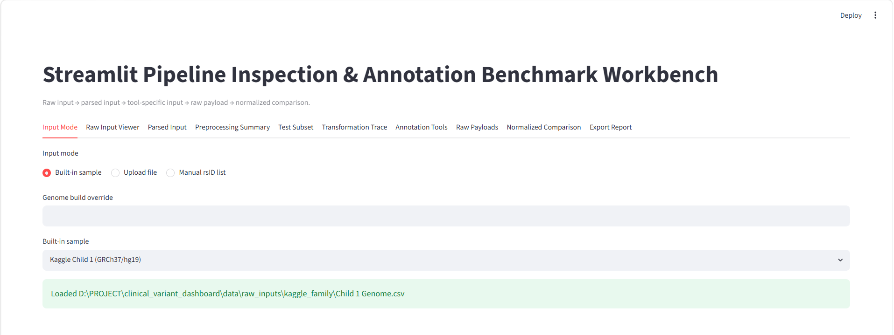
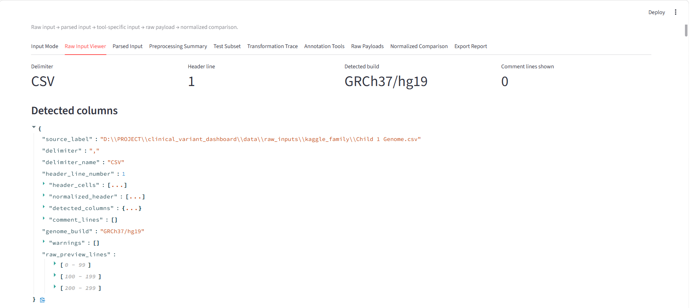
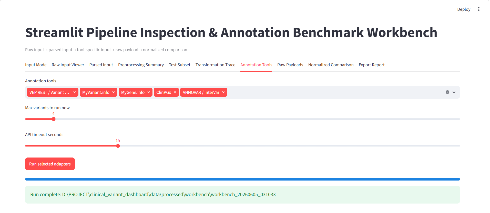
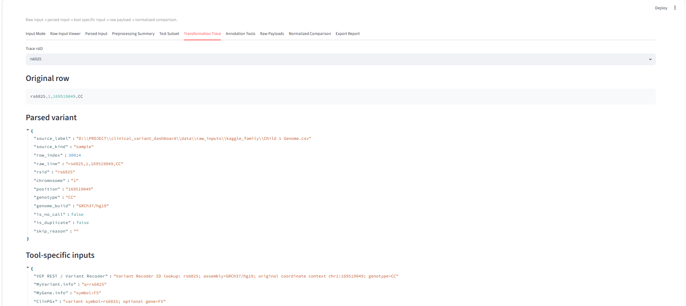
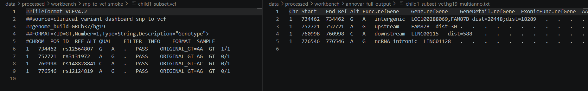
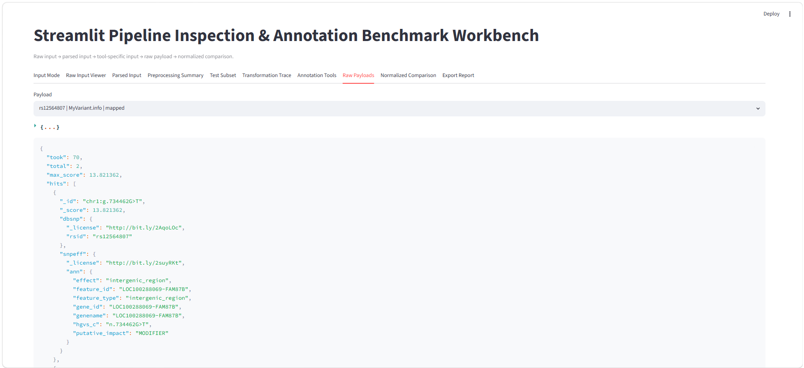

# Báo cáo tuần 2: Pipeline Inspection & Annotation Benchmark Workbench

## A. Executive Summary & Deliverables

Tuần 1 đã xác lập được input format và danh sách annotation tools cần kiểm thử. Sang tuần 2, pipeline đã được kiểm chứng xa hơn: từ raw consumer SNP file, hệ thống trích xuất `rsID`, chuyển sang ANNOVAR-compatible input, chạy annotation, rồi tạo được InterVar classification output. Kết quả quan trọng nhất là pipeline đã phân loại được các variant theo mức độ evidence liên quan bệnh, bao gồm `Benign`, `Likely benign`, `Uncertain significance`, và đặc biệt đã xuất hiện nhóm `Likely pathogenic`.

Vì vậy, tuần 2 không chỉ dừng ở preprocessing hay tool survey, mà đã có artifact đầu ra thật cho bài toán **SNP → annotation → disease-relevance classification**. Local **ANNOVAR + InterVar** path đã tạo được `multianno.txt` và `.intervar` output, đồng thời vẫn giữ được traceability về `rsID`, genotype gốc, mapping status, và raw output path. Điều này cho thấy pipeline đã sẵn sàng chuyển sang giai đoạn sau: chuẩn hóa kết quả, lọc các variant ưu tiên cao, và đưa evidence vào dashboard/report.

Sau khi route offline chạy được, workbench đã được mở rộng thêm tab **Full SNP → InterVar** để chạy full local DB pipeline trực tiếp từ current UI input. Run `run_20260605_165354` trên Child 1 mất khoảng 28 phút theo quan sát UI, tạo 788,431 InterVar data rows và review queue có 3 `Likely pathogenic` findings.

Kết quả này là nền tảng cho tuần 3 mở rộng sang normalized evidence scoring, multi-tool comparison, và chatbot/report assistant có `scope boundary` rõ ràng. Các variant thuộc nhóm `Likely pathogenic` sẽ được xem như finding cần review trước, không phải kết luận chẩn đoán tự động.

Pipeline đang nhắm tới:

```text
raw input
  → parsed input
  → tool-specific input
  → raw output / raw payload
  → normalized comparison
  → dashboard/report-ready finding
```

### Deliverables tuần 2

| Status | Deliverable | Artifact / path | Ý nghĩa |
| --- | --- | --- | --- |
| ✅ Done | Streamlit workbench | `src/dashboard/streamlit_app.py` | GUI nội bộ để inspect input, run adapters, xem raw payload và export benchmark. |
| ✅ Done | Observable parser | `src/workbench/input_parser.py` | Parse CSV/TSV/23andMe-like input, expose delimiter/header/build/no-call/duplicate/skipped rows. |
| ✅ Done | Benchmark subset + transformation trace | `src/workbench/benchmark.py` | Tạo sample-present subset, curated controls, và tool-specific input trace. |
| ✅ Done | Annotation adapter layer | `src/workbench/adapters.py` | Chạy REST/GraphQL adapters và local ANNOVAR curated adapter; tool chưa setup trả status rõ ràng. |
| ✅ Done | SNP-to-VCF subset converter | `src/preprocessing/snp_to_vcf.py` | Convert selected consumer SNP rows sang VCF khi `REF/ALT` match genotype an toàn. |
| ✅ Done | ANNOVAR local validation | `data/processed/workbench/annovar_full_output/` | Chạy ANNOVAR trên VCF subset và lưu full output artifacts. |
| ✅ Done | InterVar smoke test | `data/processed/workbench/annovar_full_output/child1_intervar.hg19_multianno.txt.intervar` | InterVar consumed ANNOVAR `multianno.txt` với `--skip_annovar` và tạo classification output. |
| ✅ Done | Assistant-ready evidence backbone | `multianno.txt`, `.intervar`, raw payload paths | Tạo nguồn dữ liệu có traceability để chatbot/trợ lí sau này giải thích finding dựa trên annotation run cụ thể. |
| ✅ Done | Raw payload preservation | `data/processed/workbench/<run_id>/raw_payloads/` | Giữ output gốc của từng tool để audit và source-grounding. |
| ✅ Done | Normalized comparison export | `data/processed/workbench/<run_id>/normalized_comparison.csv` | Bảng summary cho coverage/runtime/status/error comparison. |
| ✅ Done | Unit tests | `tests/test_workbench_parser.py`, `tests/test_snp_to_vcf.py` | Kiểm tra parser, manual rsID mode, transformation trace và SNP-to-VCF conversion. |
| ✅ Done | Official ANNOVAR/InterVar workflow notes | `docs/supplementary/annovar_intervar_official_workflow_notes.md` | Chốt route chuẩn: VCF/avinput → ANNOVAR `multianno` → InterVar; consumer SNP phải qua rsID/avinput và join-back genotype. |
| ✅ Done | ANNOVAR rsID-route preparation workflow | `src/preprocessing/build_annovar_intervar_testset.py` | Tạo `original_variants.tsv`, `rsids.txt`, optional dbSNP subset, command file, manifest và `join_back.tsv` cho route chính thức. |
| ✅ Done | ANNOVAR rsID-route Phase 0 | `data/processed/workbench/annovar_rsid_route/phase0_curated/` | 6 curated rsID từ consumer SNP route tạo 7 `avinput` rows, chạy ANNOVAR `multianno`, join-back genotype và InterVar output. |
| ✅ Done | Full-file ANNOVAR rsID route | `data/processed/workbench/annovar_rsid_route/phase2_full_child1/` | 592,580 selected rsIDs tạo 569,497 `avinput` rows, `multianno.txt`, `.intervar`, và `join_back.tsv` có traceability. |
| ✅ Done | Streamlit full SNP → InterVar run tab | `src/workbench/intervar_pipeline.py`, `data/processed/workbench/full_intervar_runs/run_20260605_165354/` | Chạy full pipeline từ current UI input; 592,580 selected rsIDs, 549,294 primary-contig `avinput` rows, 788,431 InterVar rows, 3 `Likely pathogenic`, 2,090 `Uncertain significance`. |

---

## B. Workbench Design

Consumer SNP annotation không phải là bài toán một bước — từ raw file đến clinical finding đi qua ít nhất năm lớp transform, và mỗi annotation tool lại có input/output format hoàn toàn khác nhau. Nếu chỉ nhìn vào kết quả cuối, rất khó biết một variant "unresolved" là do parser bỏ sót, do tool-specific input sai format, hay do tool thực sự không có record. Workbench được thiết kế để giải quyết đúng vấn đề này: thay vì chỉ chạy annotation và trả kết quả, nó expose toàn bộ intermediate state — từ raw row cho đến raw payload — để từng bước có thể kiểm tra độc lập. Điều này đặc biệt quan trọng sau khi full-file benchmark đã tạo được InterVar output, vì giai đoạn tiếp theo cần normalize và kiểm chứng các finding ưu tiên cao một cách có traceability.

### Nguyên tắc thiết kế

Quyết định kiến trúc quan trọng nhất của workbench là:

```text
raw payload = source of truth
normalized comparison = benchmark/index layer
dashboard finding = interpreted product layer
```

Lý do giữ raw payload riêng thay vì normalize ngay từ đầu: mỗi tool trả về schema khác nhau (MyVariant.info là JSON nested variant-centric, VEP là consequence/transcript-centric, ANNOVAR là TSV multianno). Normalize sớm sẽ buộc phải chọn một schema chung — và schema đó sẽ mất thông tin của những tool có format phong phú hơn. Bằng cách giữ raw payload, audit sau này vẫn có thể quay lại nguồn gốc nếu normalized comparison có discrepancy. Normalized layer chỉ là index/summary để so sánh nhanh giữa các tool, không thay thế payload gốc.

### GUI tabs

| Tab | Vai trò trong pipeline |
| --- | --- |
| `Input Mode` | Chọn built-in sample, upload file, hoặc paste manual rsID list. |
| `Raw Input Viewer` | Xem raw preview, delimiter/header/comment lines và genome build warning. |
| `Parsed Input` | Xem internal parsed table với `rsid`, `chromosome`, `position`, `genotype`, `row_index`, `is_no_call`, `is_duplicate`. |
| `Preprocessing Summary` | Row counts, valid genotype, no-call, missing rsID, duplicate rsID, skipped rows. |
| `Test Subset` | Chọn sample-present top N và curated benchmark variants. |
| `Transformation Trace` | Xem original row → parsed variant → input riêng cho từng tool. |
| `Annotation Tools` | Chọn/chạy adapters trên subset nhỏ để benchmark nhanh. |
| `Raw Payloads` | Xem/download raw output theo `rsID + tool`. |
| `Normalized Comparison` | Bảng summary chung để so sánh status/field availability/runtime/errors. |
| `Full SNP → InterVar` | Chạy full local DB route trực tiếp trên current built-in/uploaded input, tạo run folder mới, summarize InterVar classification và review queue. |
| `Export Report` | Export JSON/CSV để đưa vào report hoặc làm regression evidence. |

Hai tab dưới đây minh họa điểm đầu và điểm cuối của inspection layer:



*Figure 1 — Input Mode: workbench nhận nhiều loại input khác nhau, mỗi loại có context và warning riêng.*



*Figure 2 — Raw Input Viewer & Preprocessing Summary: parser expose delimiter, header detection, no-call/duplicate counts trước khi data đi vào bất kỳ bước nào.*

---

## C. Benchmark Setup

Để benchmark có giá trị, cần phân biệt rõ hai loại input: consumer SNP file thực tế (có genotype context nhưng không có clinical enrichment sẵn) và manual rsID list (dùng để validate tool behavior thuần túy, không có sample context). Section này mô tả cách workbench xử lý cả hai, và lý do chọn tập curated variants thay vì dùng ngẫu nhiên top N rows từ Child 1.

### Input modes

| Mode | Use case | Ghi chú |
| --- | --- | --- |
| Built-in sample | Test nhanh với dữ liệu repo. | Kaggle `Child 1` là sample chính, GRCh37/hg19. |
| Upload file | Test CSV/TSV/TXT/23andMe-like file mới. | Parser detect delimiter/header và warning. |
| Manual rsID list | Test annotation APIs nhanh. | Không có genotype/sample context, chỉ dùng để validate tool behavior. |

### Curated benchmark variants

Top N rows đầu tiên của Child 1 không có giá trị cao để benchmark annotation vì phần lớn là intergenic/non-coding variants không có ClinVar record. Tập curated dưới đây được chọn để cover đủ các loại evidence mà pipeline cần xử lý:

| Nhóm | Variants | Vai trò |
| --- | --- | --- |
| Clinical / PGx rich | `rs6025`, `rs4244285`, `rs1799853`, `rs1057910`, `rs9923231` | Test clinical/PGx evidence và drug context. |
| Research / common controls | `rs3093017`, `rs12562034` | Test research association hoặc ordinary consumer SNP behavior. |
| Additional controls | `rs7412`, `rs429358`, `rs1801133` | Test common/clinical examples và gene hints. |

### Tool adapters

| Tool | Status | Raw output type | MVP role |
| --- | --- | --- | --- |
| VEP REST / Variant Recoder | Runnable | JSON | Prototype consequence/variant recoding path. |
| ClinVar E-utilities | Runnable | JSON | Primary clinical assertion lookup experiment. |
| MyVariant.info | Runnable | JSON | Fast variant enrichment and fallback lookup. |
| MyGene.info | Runnable with gene hint | JSON | Gene-level context after variant-to-gene mapping. |
| ClinPGx | Runnable | JSON | PGx evidence lookup. |
| GWAS Catalog | Runnable | JSON | Research association layer, không phải clinical diagnosis. |
| PubMed E-utilities | Runnable | JSON | Literature evidence links, không phải clinical assertion. |
| Open Targets | Runnable with gene hint | GraphQL JSON | Gene/target/disease explanation layer. |
| OpenCRAVAT | Setup-required / sidecar | SQLite/TSV/XLSX | File-level validation and exploratory reports. |
| ANNOVAR / InterVar | Local full rsID route completed | `multianno.txt`, VCF, `.intervar` | Đã tạo full Child 1 classification output; direct/default DB mode vẫn pending vì thiếu database nặng. |
| SnpEff / SnpSift | Setup-required | VCF | Alternative local VCF-first consequence annotation. |
| PharmCAT | Setup-required | JSON/HTML/TSV | PGx-specific pipeline khi VCF/calls đáng tin cậy. |
| ClinGen Allele Registry | Research-required | JSON/JSON-LD | Canonical allele identity / normalization. |
| gnomAD direct | Research-required | GraphQL/table JSON | Direct frequency enrichment sau coordinate normalization. |
| OMIM | API-key/license-required | JSON | Gene-disease reference layer, không phải core SNP annotation. |
| CADD / dbNSFP / REVEL / AlphaMissense | License/setup-required | JSON/TSV | Prediction score enrichment sau khi clinical core ổn định. |

### Smoke test kết quả

Smoke test với `rs6025` — một variant trong gene F5 có ClinVar record rõ ràng, dùng làm baseline kiểm tra các research adapters có resolve đúng không:

```text
ClinVar E-utilities: mapped
GWAS Catalog: mapped
PubMed E-utilities: mapped
Open Targets: mapped
```

Kết quả khớp với expected: `rs6025` (Factor V Leiden) có clinical assertion trong ClinVar, research association trong GWAS Catalog, và gene F5 resolve được qua Open Targets. Không có tool nào trả `unresolved` hoặc `api_error`, xác nhận adapter layer hoạt động đúng với curated variant rõ ràng.

ANNOVAR smoke test — kiểm tra pipeline từ curated `avinput` đến `multianno` output:

```text
Install validation: tools/annovar/example/ex1.avinput → mapped multianno output
Curated hg19 avinput: 7 allele rows → mapped multianno output
Adapter smoke:
  rs6025   → mapped, gene F5,     clinical_fields present
  rs4244285 → mapped, gene CYP2C19, clinical_fields present, pgx_fields present
  rs7412   → mapped, gene APOE,   clinical_fields present, pgx_fields present
  rs1801133 → mapped, gene MTHFR, clinical_fields present, pgx_fields present
```

Tất cả 4 curated variants resolve đúng gene và có clinical/PGx fields populated — đây là expected behavior với variants được chọn có chủ đích. Kết quả này xác nhận ANNOVAR adapter đọc đúng `multianno.txt` và map đúng columns sang normalized schema. Phần E sẽ mô tả chi tiết schema đó.

Raw payload/output locations:

```text
data/processed/workbench/smoke_research_adapters/
data/processed/workbench/annovar_smoke/
data/processed/workbench/smoke_annovar_adapter/raw_payloads/annovar___intervar/
```



*Figure 3 — Annotation Tools Benchmark: normalized comparison cho phép so sánh status, field availability, và runtime giữa các tool trên cùng một tập rsIDs.*

---

## D. Technical Execution

Ba thành phần kỹ thuật được build trong tuần 2 đều giải quyết cùng một vấn đề cốt lõi: consumer SNP files thiếu thông tin mà VCF-first tools cần, và không có một con đường chuyển đổi nào hoàn toàn không có ambiguity. Observable parser xử lý phía input; SNP-to-VCF bridge xử lý phía conversion; ANNOVAR integration là validation end-to-end đầu tiên cho toàn bộ pipeline. Cả ba cùng nhau tạo ra một chuỗi traceable từ raw consumer row đến annotation/classification output, trong đó Phase 2 đã mở rộng được sang full-file Child 1 để chuẩn bị cho normalized scoring.

### 1. Observable preprocessing

Input hiện tại đã verified:

```text
data/raw_inputs/kaggle_family/Child 1 Genome.csv
```

Input shape:

```text
rsid, chromosome, position, genotype
```

Parser expose toàn bộ intermediate state:

- detected delimiter/header
- genome build override hoặc detection
- no-call rows
- duplicate rsID rows
- skipped rows
- original row index để traceability

Mục đích của việc giữ `row_index` gốc: bất kỳ variant nào sau này bị annotate sai hoặc bị skip đều có thể trace về đúng dòng trong file gốc, không cần scan lại toàn bộ file.



*Figure 4 — Transformation Trace: mỗi rsID có thể được inspect độc lập qua từng bước transform, giúp isolate lỗi theo layer.*

### 2. SNP-to-VCF bridge

Consumer SNP files không chứa `REF/ALT`, trong khi VCF-first tools yêu cầu:

```text
CHROM, POS, ID, REF, ALT, GT
```

Conversion pipeline:

```text
consumer SNP row
  → MyVariant rsID resolution payload
  → candidate chr:g.posRef>Alt records
  → genotype/ref-alt match check
  → VCF row nếu unambiguous
  → manifest skip nếu ambiguous/no match/possible strand flip
```

Artifacts:

```text
src/preprocessing/snp_to_vcf.py
data/processed/workbench/snp_to_vcf_smoke/child1_subset.vcf
data/processed/workbench/snp_to_vcf_smoke/manifest.json
data/processed/workbench/snp_to_vcf_smoke/resolver_payloads/
```

Smoke result trên Child 1 subset:

```text
converted: 4
skipped: 0
```

VCF preview:

```text
#CHROM POS    ID          REF ALT FORMAT SAMPLE
1      734462 rs12564807  G   A   GT     1/1
1      752721 rs3131972   A   G   GT     0/1
1      760998 rs148828841 C   A   GT     0/1
1      776546 rs12124819  A   G   GT     0/1
```

Kết quả này khớp với expected: 4 variants đầu của Child 1 subset đều là SNPs phổ biến với allele mapping không ambiguous, nên conversion thành công hoàn toàn. Trường hợp thực tế với full file sẽ có tỷ lệ skip cao hơn do strand flip và multi-allelic variants — manifest.json ghi nhận từng trường hợp này để audit.

Converter được thiết kế intentionally conservative: skip thay vì guess khi allele mapping ambiguous. Điều này đảm bảo VCF output dùng cho ANNOVAR và VEP CLI là clean, không có false allele assignments.

Sau khi review official ANNOVAR docs, bridge này được giữ như **VCF-first experimental path**, không phải route chính cho ANNOVAR/InterVar từ consumer SNP. Route chuẩn hơn cho ANNOVAR benchmark là `rsID list → convert2annovar -format rsid → avinput → table_annovar → join-back genotype`, vì nó bám đúng input contract của ANNOVAR và tránh mô tả sai thành raw SNP → clinical output trực tiếp.

### 3. ANNOVAR VCF-mode full output

Mục tiêu:

```text
Child 1 consumer SNP rows
  → safe SNP-to-VCF subset conversion
  → ANNOVAR VCF input mode
  → refGene + ClinVar table annotation
  → full raw output artifacts
```

Command:

```powershell
wsl bash -lc "cd /mnt/d/PROJECT/clinical_variant_dashboard && \
perl tools/annovar/table_annovar.pl \
  data/processed/workbench/snp_to_vcf_smoke/child1_subset.vcf \
  tools/annovar/humandb \
  -buildver hg19 \
  -out data/processed/workbench/annovar_full_output/child1_subset_vcf \
  -protocol refGene,clinvar_20240917 \
  -operation g,f \
  -nastring . \
  -otherinfo \
  -vcfinput"
```

ANNOVAR log summary:

```text
VCF lines read: 9
Loci passed QC: 4
SNPs annotated: 4
Transitions/transversions: 3 transitions, 1 transversion
Indels/substitutions: 0
Samples: 1
```

Full output artifacts:

| File | Ý nghĩa |
| --- | --- |
| `child1_subset_vcf.avinput` | ANNOVAR intermediate input converted từ VCF. |
| `child1_subset_vcf.refGene.variant_function` | Gene-region classification output. |
| `child1_subset_vcf.refGene.exonic_variant_function` | Exonic consequence output; empty cho subset này. |
| `child1_subset_vcf.hg19_clinvar_20240917_filtered` | Variants không matched bởi ClinVar filter. |
| `child1_subset_vcf.hg19_clinvar_20240917_dropped` | ClinVar-matched variants; empty cho subset này. |
| `child1_subset_vcf.hg19_multianno.txt` | Main ANNOVAR table output. |
| `child1_subset_vcf.hg19_multianno.vcf` | Annotated VCF giữ nguyên original GT và ANNOVAR INFO fields. |
| `child1_subset_vcf.log`, `child1_subset_vcf.refGene.log` | Run logs để audit/debug. |

Main `multianno` result:

| rsID | Original GT | VCF allele | Func.refGene | Gene.refGene | ClinVar signal |
| --- | --- | --- | --- | --- | --- |
| `rs12564807` | `AA` | `G>A`, GT `1/1` | `intergenic` | `LOC100288069,FAM87B` | none |
| `rs3131972` | `AG` | `A>G`, GT `0/1` | `upstream` | `FAM87B` | none |
| `rs148828841` | `AC` | `C>A`, GT `0/1` | `downstream` | `LINC00115` | none |
| `rs12124819` | `AG` | `A>G`, GT `0/1` | `ncRNA_intronic` | `LINC01128` | none |

Kết quả này là expected: 4 variants đầu của Child 1 đều là intergenic/non-coding variants gần chromosome 1q, không có ClinVar record — đây chính là lý do tập curated (rs6025, rs4244285, v.v.) phải được dùng cho clinical/PGx benchmark thay vì top N rows. Phần quan trọng không phải là annotation kết quả, mà là pipeline đã chạy thành công end-to-end từ consumer SNP row qua VCF conversion đến `multianno.txt` output.



*Figure 5 — SNP-to-VCF bridge và ANNOVAR output: pipeline từ consumer SNP đến annotated VCF hoạt động end-to-end; `-vcfinput` giữ nguyên genotype context trong annotated VCF.*

### 4. InterVar classification smoke test

Sau khi ANNOVAR đã tạo được `multianno.txt`, bước kiểm chứng tiếp theo là xem output này có thể đi tiếp vào classification layer hay không. InterVar được chọn cho smoke test vì nó dùng ANNOVAR output làm input và tạo ra ACMG-style evidence fields, phù hợp với hướng Week 3 là evidence-priority scoring chứ không phải disease prediction. Mục tiêu của test này không phải kết luận clinical meaning cho Child 1 subset, mà là xác nhận local ANNOVAR/InterVar toolchain có thể chạy end-to-end trong WSL và tạo artifact có thể parse về sau.

Run context:

```text
Repo path: /mnt/d/PROJECT/clinical_variant_dashboard
ANNOVAR: tools/annovar/
InterVar: tools/InterVar/
Input: data/processed/workbench/annovar_full_output/child1_subset_vcf.avinput
Existing ANNOVAR table: data/processed/workbench/annovar_full_output/child1_intervar.hg19_multianno.txt
```

Successful command:

```bash
cd /mnt/d/PROJECT/clinical_variant_dashboard/tools/InterVar

python3 Intervar.py \
  -b hg19 \
  -i ../../data/processed/workbench/annovar_full_output/child1_subset_vcf.avinput \
  --input_type=AVinput \
  -o ../../data/processed/workbench/annovar_full_output/child1_intervar \
  --skip_annovar
```

InterVar terminal result:

```text
Notice: Begin the variants interpretation by InterVar
Notice: About 4 lines in your variant file!
Notice: About 5 variants has been processed by InterVar
Notice: The InterVar is finished, the output file is [
../../data/processed/workbench/annovar_full_output/child1_intervar.hg19_multianno.txt.intervar
]
```

Generated artifacts:

| File | Ý nghĩa |
| --- | --- |
| `child1_intervar.hg19_multianno.txt` | Canonical ANNOVAR input name expected by InterVar when using `--skip_annovar`. |
| `child1_intervar.hg19_multianno.txt.grl_p` | InterVar intermediate output. |
| `child1_intervar.hg19_multianno.txt.intervar` | Main InterVar classification output. |
| `child1_intervar.hg19__multianno.txt` | Accidental/debug copy; không dùng làm canonical input. |

InterVar output includes fields that are useful for later normalization:

```text
#Chr
Start
End
Ref
Alt
Ref.Gene
Func.refGene
ExonicFunc.refGene
clinvar: Clinvar
InterVar: InterVar and Evidence
Freq_gnomAD_genome_ALL
Freq_esp6500siv2_all
Freq_1000g2015aug_all
CADD_raw
CADD_phred
SIFT_score
GERP++_RS
OMIM
Phenotype_MIM
OrphaNumber
Orpha
Otherinfo
```

Observed result on this small subset:

```text
InterVar classification: Benign
ClinVar status: UNK
Evidence pattern example: BA1=1, BS=[1, 0, 0, 0, 0], PP=[0, 0, 1, 0, 0, 0]
```

Kết quả này match expectation cho subset hiện tại: 4 variants đầu của Child 1 là common/non-coding hoặc gần gene region, không phải ClinVar-rich benchmark set. Giá trị chính của test nằm ở integration evidence: InterVar đọc được ANNOVAR `multianno.txt`, produce `.intervar`, và expose ACMG-style evidence fields để Week 3 có thể viết parser/normalizer. Classification `Benign` ở đây không nên được xem là clinical conclusion cho user; nó chỉ chứng minh adapter/CLI path chạy được trên artifact nhỏ.

Đóng góp thực tế của phần này là biến ANNOVAR/InterVar từ một toolchain “có thể dùng sau” thành một backend candidate đã có artifact thật. Với `multianno.txt`, `.intervar`, raw file path, và original VCF/sample context, chatbot/trợ lí sau này có thể trả lời các câu như variant này thuộc gene nào, vì sao được ưu tiên thấp/cao, evidence đến từ ANNOVAR hay InterVar, và record gốc nằm ở đâu. Đây là bước chuẩn bị trực tiếp cho citation-grounded reporting: assistant không tự suy diễn clinical meaning, mà giải thích dựa trên selected annotation run và các source đã lưu.

Important caveats:

| Caveat | Impact | Mitigation |
| --- | --- | --- |
| `mim2gene.txt` là runtime dependency bắt buộc | InterVar fail nếu thiếu OMIM mapping file. | Đã cài `tools/InterVar/intervardb/mim2gene.txt`; cần document dependency trong setup notes. |
| `--skip_annovar` đang được dùng | InterVar không tự gọi ANNOVAR; nó chỉ consume pre-existing `multianno.txt`. | Patch `tools/InterVar/config.ini` nếu muốn direct ANNOVAR call. |
| InterVar config còn trỏ script path kiểu `./annotate_variation.pl` | Direct mode chưa chạy được từ InterVar folder. | Trỏ sang `../annovar/annotate_variation.pl`, `../annovar/table_annovar.pl`, `../annovar/convert2annovar.pl`, `../annovar/humandb`. |
| Database set chưa khớp InterVar default config | Một số evidence columns có thể là placeholder-like values. | Align `database_names` với installed ANNOVAR humandb hoặc download expected resources. |
| Small VCF smoke subset không ClinVar-rich | Subset 4 variants chỉ chứng minh toolchain chạy được, chưa đại diện cho clinical recall. | Dùng full rsID-route output và curated variants có `Likely pathogenic` để normalize/review ở bước sau. |

Traceability/safety implication: output này cần đi qua `traceability layer` bằng cách giữ link từ `.intervar` row về `raw_intervar_path`, `raw_annovar_multianno_path`, original VCF ID, và original consumer SNP row. Với các dòng `Likely pathogenic` đã xuất hiện trong full rsID-route output, `HITL review gate` phải được bật trước khi hiển thị như một finding trong dashboard.

### 5. ANNOVAR rsID route

Documentation xác nhận một route hợp lệ khác:

```bash
convert2annovar.pl -format rsid rsids.txt -dbsnpfile humandb/hg19_snp138.txt > rsids.avinput
```

Project implication:

```text
consumer SNP file
  → extract rsID list
  → convert2annovar -format rsid dùng local dbSNP
  → get chr/start/end/ref/alt
  → join converted variants back to original genotype rows
  → giữ multiple mapping / allele ambiguity flags
  → run table_annovar
```

Test thực hiện:

```text
Downloaded:
tools/annovar/humandb/hg19_snp138.txt
tools/annovar/humandb/hg19_snp138.txt.idx

Created:
data/processed/workbench/annovar_rsid_route/curated_test_rsids.txt
```

Raw `convert2annovar -format rsid` test:

```text
Input rsIDs: 7
Command started scanning hg19_snp138.txt
Timed out sau khoảng 5 phút, không produce avinput rows
Partial output: 0 bytes
Log: "NOTICE: Scanning dbSNP file tools/annovar/humandb/hg19_snp138.txt..."
```

Follow-up implementation đã giải quyết bottleneck này bằng cách pre-extract exact-match dbSNP subset với `rg`, sau đó vẫn dùng `convert2annovar -format rsid` đúng theo ANNOVAR docs:

```text
Input rsIDs: 6
dbSNP subset: hg19_snp138.selected.txt
convert2annovar output: converted.avinput
Output rows: 7
Reason for 7 rows: rs4244285 maps to two alleles, G>A and G>C
```

`converted.avinput` preview:

```text
chr1   768448     768448     G   A   rs12562034
chr1   11856378   11856378   G   A   rs1801133
chr1   169519049  169519049  T   C   rs6025
chr10  96541616   96541616   G   A   rs4244285
chr10  96541616   96541616   G   C   rs4244285
chr19  45412079   45412079   C   T   rs7412
chr6   167541258  167541258  C   G   rs3093017
```

Sau đó `table_annovar.pl` chạy thành công trên `converted.avinput`:

```text
Input avinput lines: 7
Protocols: refGene, clinvar_20240917
Output: annovar_child1.hg19_multianno.txt
```

Main annotation signals:

| rsID | Sample context | ANNOVAR gene/consequence | ClinVar / InterVar signal |
| --- | --- | --- | --- |
| `rs12562034` | External benchmark, no sample genotype | `LINC01128`, `ncRNA_intronic` | ClinVar `UNK`, InterVar `Benign` |
| `rs1801133` | Child 1 `GG` | `MTHFR`, nonsynonymous SNV | ClinVar `drug_response`, InterVar `Benign` |
| `rs6025` | Child 1 `CC` | `F5`, nonsynonymous SNV | ClinVar conflicting, InterVar `Uncertain significance` |
| `rs4244285` | Child 1 `AG` | `CYP2C19`, synonymous SNV | One mapped allele matches sample ALT; second allele flagged mismatch |
| `rs7412` | Child 1 `CC` | `APOE`, nonsynonymous SNV | ClinVar `drug_response`, InterVar `Likely pathogenic` |
| `rs3093017` | External benchmark, no sample genotype | `CCR6`, intronic | ClinVar `UNK`, InterVar `Benign` |

`join_back.tsv` is the key safety artifact. It shows which ANNOVAR rows have sample genotype context and which rows are only external benchmark controls:

```text
rs6025   → sample_carries_alt
rs4244285 G>A → sample_carries_alt
rs4244285 G>C → genotype_ref_alt_mismatch
rs12562034 / rs3093017 → no_sample_context
```

Kết quả này xác nhận route chuẩn cho project:

```text
consumer SNP
  → preserve rsID/genotype/row_index
  → rsID list
  → dbSNP subset
  → convert2annovar -format rsid
  → converted.avinput
  → table_annovar
  → multianno
  → join-back genotype
  → InterVar evidence
```

Full-file Phase 2 đã chạy trên toàn bộ `Child 1 Genome.csv` và tạo artifact có thể dùng để demo audit path:

```text
Input rows: 601,802
Valid genotype rows: 592,578
Selected rsIDs: 592,580
Mapped in selected dbSNP subset: 546,068
Unresolved in selected dbSNP subset: 46,512
Multi-mapping rsIDs: 4,147
Converted avinput rows processed by ANNOVAR: 569,497
```

Main artifacts:

| Artifact | Path | Vai trò demo |
| --- | --- | --- |
| Manifest | `data/processed/workbench/annovar_rsid_route/phase2_full_child1/conversion_manifest.json` | Tóm tắt row counts, mapped/unresolved/multi-mapping, và đường dẫn output. |
| rsID list | `data/processed/workbench/annovar_rsid_route/phase2_full_child1/rsids.txt` | Danh sách rsID đã extract từ raw consumer file + external benchmark controls. |
| Converted avinput | `data/processed/workbench/annovar_rsid_route/phase2_full_child1/converted.avinput` | Coordinate/ref/alt input cho ANNOVAR sau `convert2annovar -format rsid`. |
| ANNOVAR output | `data/processed/workbench/annovar_rsid_route/phase2_full_child1/annovar_child1.hg19_multianno.txt` | Full `refGene + clinvar_20240917` annotation table. |
| InterVar output | `data/processed/workbench/annovar_rsid_route/phase2_full_child1/intervar_child1.hg19_multianno.txt.intervar` | ACMG-style evidence output để chuẩn bị normalized scoring. |
| Join-back audit | `data/processed/workbench/annovar_rsid_route/phase2_full_child1/join_back.tsv` | Nối ANNOVAR/InterVar rows về `row_index`, genotype gốc, mapping status, và warning. |

Sau đó route này được đưa vào Streamlit thành tab **Full SNP → InterVar**, tức là không còn chỉ đọc artifact Child 1 có sẵn nữa. Tab này lấy current UI input, tạo run folder mới, chạy local DB route, rồi normalize InterVar classification ngay trong dashboard. Manual rsID mode bị disable cho full run vì không có genotype/sample context; built-in hoặc uploaded consumer SNP file mới là input hợp lệ.

Observed Streamlit full run:

```text
Run folder: data/processed/workbench/full_intervar_runs/run_20260605_165354/
UI-observed runtime: khoảng 28 phút, từ 4:48 PM đến 5:16 PM
Artifact timestamp runtime: khoảng 21 phút 50 giây, từ 4:53:54 PM đến 5:15:44 PM
convert2annovar phase: 9.75 giây
table_annovar phase: 1 phút 22 giây
InterVar phase: 13 phút 34 giây
join_back + parse/write/output: vài chục giây đến vài phút, tùy cache/UI rerun và kích thước output
```

Phần tốn thời gian chính không nằm ở `convert2annovar` hay `table_annovar`, mà ở InterVar và bước ghi/đọc output lớn. Full Child 1 tạo file `.intervar` khoảng vài trăm MB và `join_back.tsv` hơn 200 MB, nên full mode phù hợp hơn với offline benchmark hoặc advanced run; demo dashboard nên ưu tiên subset/priority mode trước.

Main line counts:

```text
592,580 rsids.txt
566,460 hg19_snp138.selected.txt
549,294 converted.avinput
549,295 annovar_child1.hg19_multianno.txt
788,432 intervar_child1.hg19_multianno.txt.intervar
549,295 join_back.tsv
```

Primary-contig filter:

```text
Unfiltered avinput rows: 569,497
Primary-contig avinput rows kept: 549,294
Non-primary contig rows skipped before ANNOVAR/InterVar: 20,203
Examples: chr6_cox_hap2, chr6_qbl_hap6, chr17_ctg5_hap1, chrUn_gl000223
```

InterVar normalized dashboard result:

| Classification | Count |
| --- | ---: |
| `Benign` | 786,336 |
| `Uncertain significance` | 2,090 |
| `Likely pathogenic` | 3 |
| `Likely benign` | 2 |

Kết quả này chứng minh tab full pipeline đã có thể chạy từ raw SNP input trong UI đến InterVar review queue, không chỉ load lại output offline. Tuy nhiên InterVar vẫn exit non-zero sau khi đã ghi `.intervar` vì một số evidence columns có placeholder không numeric (`X`) ở bước `dbscSNV` check. Workbench xử lý bằng cách giữ `.intervar` output đã sinh ra, regenerate `join_back.tsv`, hiển thị warning trong UI, và normalize kết quả như evidence cần review thay vì xem run là clinical-grade clean pass.

Kết quả này không biến ANNOVAR/InterVar thành runtime chính của MVP, nhưng nó biến route offline benchmark thành một artifact thật có thể show: từ raw SNP file, qua resolver dbSNP, tới annotation output và quay lại original genotype context. Phần còn chưa nên chạy tự động là **InterVar direct/default database route** với `dbnsfp42a`, `gnomad_genome`, `1000g2015aug`, `avsnp147`, `esp6500siv2_all`, `dbscsnv11`, `rmsk`, `ensGene`, `knownGene`; các DB này nặng, dễ phụ thuộc mirror, và nên chạy manual khi cần evidence-grade InterVar default config.

Quyết định:

```text
Giữ cả hai bridge song song:
1. SNP → VCF subset conversion cho VCF-first tools và quick downstream testing.
2. ANNOVAR rsID → avinput route cho offline ANNOVAR sau khi dbSNP resolver được optimize.
```

rsID route hoàn toàn hợp lệ về mặt kỹ thuật, nhưng naive full-file scanning trực tiếp trên `hg19_snp138.txt` không phù hợp cho interactive workflow. Vì vậy, workflow mới đã được tách khỏi `snp_to_vcf.py` và dùng exact-match dbSNP subset để tạo output full-file có thể audit trong:

```text
src/preprocessing/build_annovar_intervar_testset.py
docs/supplementary/annovar_intervar_official_workflow_notes.md
```

Script này chuẩn bị route theo tài liệu chính thức:

```text
consumer SNP parser
  → original_variants.tsv
  → rsids.txt
  → optional exact-match dbSNP subset
  → commands.sh cho convert2annovar/table_annovar/InterVar
  → conversion_manifest.json
  → join_back.tsv nếu converted.avinput đã tồn tại
```

Thiết kế quan trọng nhất là `join_back.tsv`: vì `convert2annovar -format rsid` không tự giữ sample genotype interpretation, output ANNOVAR phải được nối lại với `row_index`, `rsid`, `original_genotype`, `genome_build` và flag `multi_mapping`, `no_sample_context`, hoặc `genotype_ref_alt_mismatch`. Đây là phần làm cho ANNOVAR/InterVar output có thể dùng làm citation-grounded evidence cho dashboard/chatbot mà không mất traceability.



*Figure 6 — Raw Payload Viewer: raw output được giữ nguyên theo `rsID + tool`, cho phép audit và source-grounding độc lập với normalized comparison.*

---

## E. Evaluation Framework

Evaluation tuần 2 tập trung vào việc biến pipeline từ một black box thành một chuỗi artifact có thể audit. Vì annotation tools có thể trả về clinical-looking fields, framework này không chỉ đo `mapped/unresolved`, mà còn phải bảo đảm mỗi kết quả có raw source, warning, và scope boundary rõ ràng trước khi đi vào dashboard. Kiến trúc safety cho MVP gồm ba lớp: `traceability layer`, `HITL review gate`, và `scope boundary`.

| Layer | Design intent trong Week 2 workbench |
| --- | --- |
| `traceability layer` | Mỗi finding phải link về `annotation_run_id`, raw payload path, tool output file, và original input row. |
| `HITL review gate` | Clinically significant hoặc ACMG-style pathogenic output không được hiển thị như kết luận tự động; phải flag cần review. |
| `scope boundary` | Dashboard/assistant chỉ giải thích dữ liệu trong selected annotation run, source links, và project glossary. |

### Normalized comparison fields

```text
run_id
rsid
tool
status
gene
clinical_fields
pgx_fields
frequency_fields
source_links
raw_payload_path
runtime_ms
error
```

InterVar-specific fields planned for adapter normalization:

```text
chr
start
end
ref
alt
gene
func_refgene
exonic_func_refgene
clinvar_status
intervar_classification
acmg_evidence_raw
raw_annovar_multianno_path
raw_intervar_path
warnings
```

Các field này tách `intervar_classification` khỏi `clinical finding priority`: InterVar output là evidence input cho scoring layer, không tự động trở thành dashboard conclusion. `acmg_evidence_raw` cần giữ nguyên chuỗi evidence để audit, còn `warnings` ghi lại các caveat như `--skip_annovar`, config path chưa patch, và database coverage chưa đủ.

Supported status values:

```text
mapped
unresolved
multi_record
api_error
not_configured
skipped
```

### Test coverage

| Area | Status | Evidence |
| --- | --- | --- |
| Parser/input tests | Passed | `python -m pytest -q` → 10 tests passed. |
| Manual rsID mode | Passed | Unit test xác nhận no genotype context được đánh dấu rõ. |
| Transformation trace | Passed | Unit test xác nhận raw row và tool input được giữ tách biệt. |
| SNP-to-VCF conversion | Passed trên subset | 4 converted, 0 skipped trên Child 1 subset. |
| ANNOVAR VCF mode | Passed trên subset | 4 VCF loci annotated, full output saved. |
| InterVar skip-annovar mode | Passed trên subset | Existing ANNOVAR `multianno.txt` consumed successfully; `.intervar` output generated. |
| ANNOVAR rsID route | Passed Phase 0 curated + full Child 1 | Phase 0: 6 curated rsIDs → 7 `avinput` rows. Phase 2: 592,580 selected rsIDs → 569,497 ANNOVAR input rows with `multianno.txt` and `join_back.tsv`. |
| InterVar rsID-route output | Passed Phase 0 curated + full Child 1 | `.intervar` output generated for curated and full phase2 artifacts; direct/default InterVar DB mode remains manual. |
| Streamlit full SNP → InterVar tab | Passed with warning | `run_20260605_165354`: current UI input → fresh run folder → 549,294 primary-contig `avinput` rows → 788,431 InterVar data rows → review queue. InterVar wrote output but exited non-zero on placeholder numeric field, so UI surfaces warning and normalizes as review evidence. |

---

## F. Known Limitations & Forward Plan

Mỗi limitation dưới đây đều có mitigation cụ thể cho tuần 3 hoặc lý do tại sao nó chấp nhận được ở giai đoạn hiện tại. Mục đích là để tuần 3 không bắt đầu từ danh sách vấn đề mở, mà từ một set quyết định rõ ràng về cái gì cần fix và cái gì cần để lại.

### Known Limitations

**Full-file ANNOVAR rsID route đã chạy được nhưng chưa phải production runtime**, vì output rất lớn và được thiết kế như offline benchmark/audit artifact. Phase 2 đã tạo `converted.avinput`, `multianno.txt`, `.intervar`, và `join_back.tsv`; mitigation tuần 3 là parse/normalize output này vào comparison schema thay vì gọi ANNOVAR/InterVar trực tiếp trong dashboard request.

**Consumer SNP files không có `REF/ALT`**, nên không được đưa trực tiếp vào ANNOVAR/InterVar. Đây là giới hạn cơ bản của input format, không phải lỗi implementation — route chính thức phải đi qua `rsID → avinput`, sau đó join-back genotype gốc để biết sample có mang ALT không và có ambiguity không.

**PGP `hu43860C` là build36/hg18**, không compatible với hg19/hg38 coordinate-based tools nếu không qua liftover. Mitigation: rsID-based normalization (không dùng coordinates) hoặc liftover trước khi conversion. Sẽ xử lý nếu `hu43860C` được đưa vào benchmark chính thức.

**Manual rsID mode không có genotype context**, nên không thể produce sample-specific findings. Đây là behavior có chủ đích — manual mode chỉ dùng để validate tool behavior, không phải để tạo clinical interpretation. Documented trong workbench UI.

**GWAS/PubMed/Open Targets outputs là research/explanation evidence**, không phải clinical interpretation. Normalized comparison hiện tại chưa phân biệt rõ hai loại này trong `status` field. Mitigation: thêm `evidence_tier` field (clinical / research / explanation) vào normalized schema ở tuần 3.

**InterVar default/direct mode vẫn là manual task**, vì config mặc định cần nhiều ANNOVAR humandb nặng như `dbnsfp42a`, `gnomad_genome`, `1000g2015aug`, `avsnp147`, `esp6500siv2_all`, `dbscsnv11`, `rmsk`, `ensGene`, `knownGene`. Run hiện tại có artifact `.intervar` usable cho demo, nhưng evidence-grade direct mode cần tải/align database ngoài luồng và theo dõi log I/O.

**Streamlit full SNP → InterVar run đã chạy được nhưng còn warning ở InterVar phase**, vì InterVar vẫn có thể exit non-zero sau khi đã ghi `.intervar` nếu gặp placeholder value không numeric trong evidence columns như `dbscSNV_RF_SCORE`. Mitigation hiện tại: filter non-primary contigs trước run, giữ output đã sinh ra nếu file hợp lệ, regenerate `join_back.tsv`, và hiển thị warning trong UI. Mitigation tuần 3: thêm InterVar preflight/column sanitizer hoặc chuyển sang database set khớp InterVar default hơn.

**ANNOVAR/ClinVar/VEP/InterVar outputs cần HITL review** cho clinically significant findings. Đây là giới hạn by design — workbench không pretend to be a clinical decision tool. Cần document rõ trong output report và map về `HITL review gate` trước khi đưa vào dashboard.

### Forward Plan

| Priority | Task | Unblocks |
| --- | --- | --- |
| Done | Run Phase 0 curated ANNOVAR rsID route using generated `rsids.txt` and dbSNP subset | Official `convert2annovar → avinput → table_annovar → InterVar` route validated |
| Done | Run Phase 2 full Child 1 ANNOVAR rsID route with dbSNP subset optimization | Full-file offline benchmark artifact available for demo and parser work |
| Done | Add Streamlit **Full SNP → InterVar** tab using current UI input | Dashboard can run full local DB route and expose classification summary/review queue |
| High | Wire InterVar `.intervar` parser into normalized comparison fields | ACMG-style evidence can enter comparison/scoring layer with raw traceability |
| High | Harden InterVar full-run preflight for numeric evidence columns | Reduce non-zero InterVar exits after `.intervar` output is generated |
| Medium | Thêm `evidence_tier` field vào normalized comparison schema | Phân biệt clinical vs research adapter output |
| Medium | Curated benchmark với VEP REST và ClinVar trên full curated variant set | Multi-tool comparison có baseline |
| Manual / Heavy | Download/align full InterVar default ANNOVAR databases and monitor direct mode | Enable evidence-grade direct ANNOVAR+InterVar run beyond current offline artifact |
| Low | Liftover pipeline cho `hu43860C` (hg18 → hg19) nếu cần | Mở rộng sample set ngoài Child 1 |

### Next deliverable recommendation

Deliverable nhỏ nhất tiếp theo: viết InterVar/ANNOVAR normalizer đọc `phase2_full_child1/intervar_child1.hg19_multianno.txt.intervar` và `join_back.tsv`, xuất một `normalized_intervar_findings.csv` nhỏ với `rsid`, gene, consequence, ClinVar signal, InterVar classification, genotype match status, warning, và raw source path.
