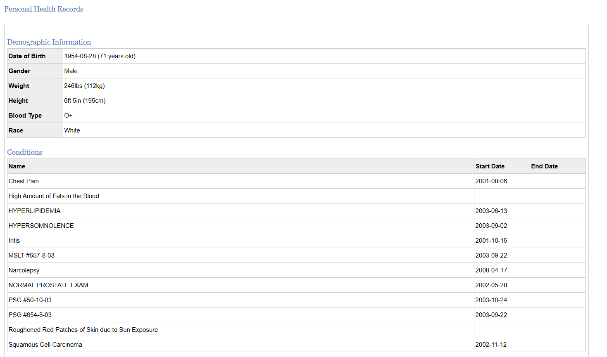

# Tổng Quan Dự Án

## 1. Tổng quan Bài toán & Định nghĩa Dữ liệu

### 1.1 Bản chất bài toán (Problem Statement)

Mục tiêu cốt lõi: Xây dựng một nền tảng trực quan (Visualization dashboard) giúp tự động hóa việc phân tích dữ liệu biến thể gen, từ đó cung cấp báo cáo tham khảo về các biến thể có liên quan đến bệnh lý, phản ứng thuốc, và đặc điểm sức khỏe dựa trên các cơ sở dữ liệu công khai.

Quy trình cốt lõi: Hệ thống tiếp nhận file gen đầu vào, tiến hành lọc biến thể (Variant filtering), đối chiếu với các cơ sở dữ liệu y khoa (Disease-associated SNP matching & Drug-response matching) và tính toán điểm rủi ro (Risk scoring).

Giá trị mang lại: Rút ngắn thời gian đọc hiểu dữ liệu gen thô, làm cầu nối hiệu quả giữa kiến thức hệ gen học phức tạp và ứng dụng y học dự phòng thực tiễn.

### 1.2 Xác định Đầu vào (Input) Và Đầu ra (Output)

Core Input: File Genome SNP/variant, ví dụ raw 23andMe/PGP hoặc CSV/VCF, chứa danh sách các biến thể gen của một cá nhân. Với file consumer genomics, các trường thường gặp là `rsid`, `chromosome`, `position` và `genotype`. Đây là dữ liệu chính để hệ thống parse, kiểm tra genome build, giữ lại bản gốc và đưa vào bước annotation.

*Hình minh họa: ví dụ file genome/SNP đầu vào dạng bảng hoặc text editor, với các dòng variant như `rsid`, `chromosome`, `position`, `genotype`. Hình này giúp người đọc hiểu input thực tế là dữ liệu thô, nhiều dòng, chưa có diễn giải y khoa.*

Optional Input: Basic patient profile hoặc personal health record, ví dụ tuổi, giới tính, ancestry/race, chỉ số cơ thể, tiền sử bệnh, điều kiện sức khỏe và thuốc đang dùng nếu có. Phần này không bắt buộc, nhưng có thể giúp đặt kết quả gen vào ngữ cảnh phù hợp hơn khi trình bày dashboard.

*Hình minh họa: ví dụ personal health record đi kèm genome file, gồm demographic information và danh sách conditions. Đây là dữ liệu ngữ cảnh, không phải đầu vào bắt buộc và không thay thế đánh giá y khoa.*

Output mong đợi: Hệ thống cần trả về các báo cáo gồm Disease risk report, Personalized health insight, và Precision medicine recommendation.

Giao diện hiển thị: Toàn bộ kết quả được tổng hợp và trực quan hóa trên một Visualization dashboard. Dashboard cần hiển thị rõ nhóm clinical findings, pharmacogenomics, population frequency, research associations, trạng thái annotation run và cảnh báo về giới hạn dữ liệu.

*Hình minh họa dự kiến: mock UI của dashboard, hiển thị các nhóm kết quả như clinical findings, pharmacogenomics, population frequency, research associations và annotation run status. Đây là mock UI phục vụ documentation/demo, chưa phải giao diện cuối.*
