# Reference Database Manual Testing Notes

Tài liệu này ghi lại kết quả test thủ công các cơ sở dữ liệu tham chiếu bằng cùng một bộ rsID mẫu. Mục đích là kiểm tra database nào có thể tra trực tiếp bằng rsID, database nào trả về clinical significance, database nào trả về association/evidence, và database nào không có record cho SNP phổ thông.

## Nhận xét tổng quan

Tóm tắt Kết quả: Test cho thấy không có một database đơn lẻ nào đủ để diễn giải toàn bộ variant từ consumer DNA file. Mỗi nguồn có vai trò khác nhau: dbSNP và gnomAD phù hợp cho định danh, chuẩn hóa và population frequency; ClinVar, ClinPGx/PharmGKB và OMIM phù hợp hơn cho các trường hợp có clinical hoặc pharmacogenomics context rõ; GWAS Catalog và LitVar hữu ích để truy vết association/literature nhưng không nên dùng trực tiếp như kết luận sức khỏe cá nhân. Với MVP, nên thiết kế pipeline theo nhiều lớp bằng chứng thay vì map đơn giản `rsID -> bệnh`.

## Quick links

- [dbSNP](#1-dbsnp)
- [ClinVar](#2-clinvar)
- [GWAS Catalog](#3-gwas-catalog)
- [ClinPGx / PharmGKB / CPIC / PharmCAT](#4-clinpgx--pharmgkb--cpic--pharmcat)
- [SNPedia](#5-snpedia)
- [gnomAD](#6-gnomad)
- [OMIM](#7-omim)
- [ClinGen](#8-clingen)
- [LitVar](#9-litvar)

## Test SNP set

| rsID | Lý do chọn |
| --- | --- |
| `rs3093017` | SNP có GWAS association rõ, gene `CCR6`, liên quan rheumatoid arthritis trong GWAS Catalog. |
| `rs6025` | Variant clinical/PGx nổi tiếng hơn, gene `F5`, có record trong ClinVar, GWAS Catalog và một số nguồn khác. |
| `rs12562034` | SNP random từ consumer DNA file, có record trong dbSNP nhưng không có record rõ trong ClinVar/GWAS Catalog. |

## Testing questions

Với mỗi database, kiểm tra:

1. Có tra trực tiếp bằng `rsID` được không?
2. Ba rsID mẫu trả kết quả gì?
3. Output chính gồm field nào?
4. Có dùng trực tiếp cho MVP không?
5. Hạn chế chính là gì?

## 1. dbSNP

### Search mode

Tra trực tiếp bằng `rsID`.

### Results

| rsID | Result |
| --- | --- |
| `rs3093017` | Có record; SNV; alleles `C>A,G,T`; chr6 position trên GRCh38/GRCh37; gene `CCR6`; consequence gồm intron/upstream; có MAF và merged ID. |
| `rs6025` | Có record; SNV; gene `F5`; missense/coding consequence; có clinical significance summary trong dbSNP; có MAF và merged IDs. |
| `rs12562034` | Có record; SNV; alleles `G>A`; chr1 position trên GRCh38/GRCh37; gene `LINC01128`; consequence intron_variant; có MAF và merged IDs. |

### Screenshots

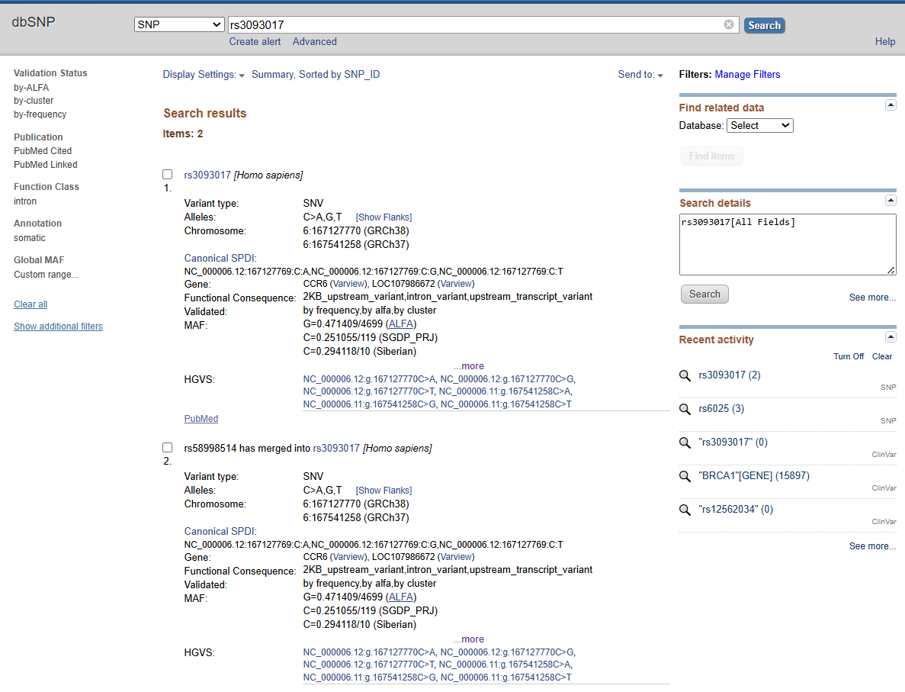

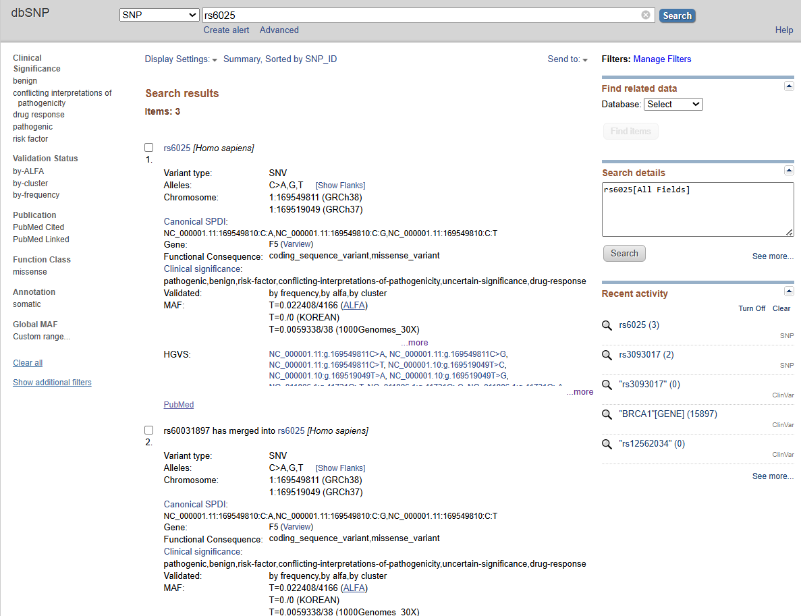

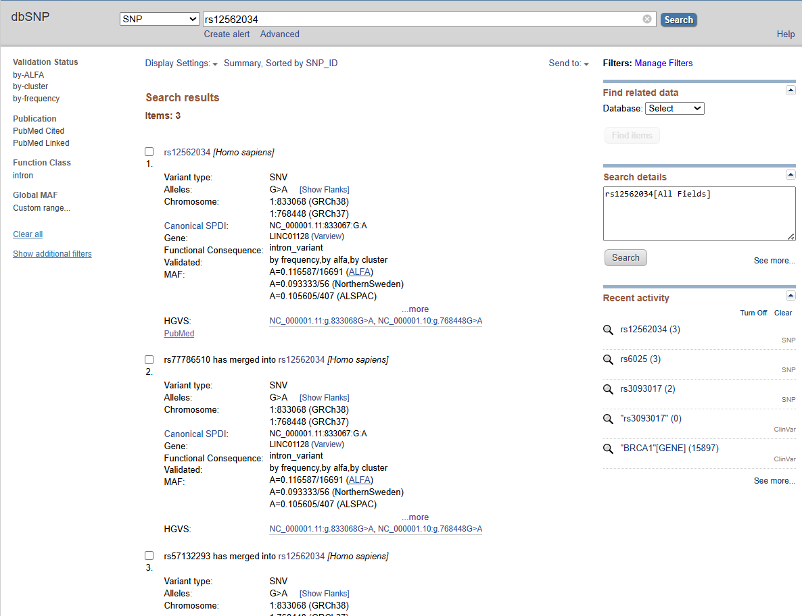

### Observed fields

`rsID`, allele, chromosome-position, genome build, gene, consequence, MAF, merged IDs, HGVS/SPDI.

### Takeaway

dbSNP phù hợp làm lớp xác thực và chuẩn hóa rsID, không dùng để kết luận bệnh lý/thuốc.

## 2. ClinVar

### Search mode

Tra bằng `rsID`, gene hoặc genomic location.

### Results

| rsID | Result |
| --- | --- |
| `rs3093017` | Không có kết quả. |
| `rs6025` | Có 3 kết quả, có clinical/drug/condition context. |
| `rs12562034` | Không có kết quả. |

### Screenshots

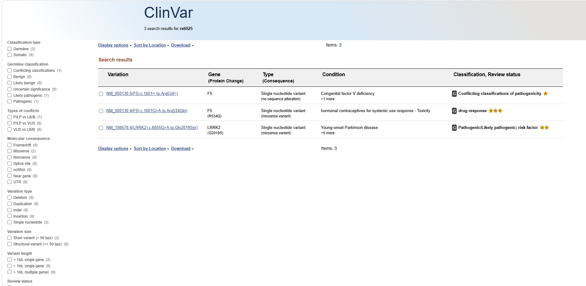

### Observed fields

Clinical significance, disease/condition, review status, submission records, variant detail.

### Takeaway

ClinVar dùng để tra clinical significance nhưng không phải rsID nào cũng có record. Không nên hiểu đơn giản là `rsID -> bệnh`.

## 3. GWAS Catalog

### Search mode

Tra bằng `rsID`, gene, trait/disease hoặc study.

### Results

| rsID | Result |
| --- | --- |
| `rs3093017` | Có variant result; gene `CCR6`; 12 associations; trait nổi bật rheumatoid arthritis; có p-value, risk allele, RAF, OR/Beta, CI, study accession. |
| `rs6025` | Có variant result; gene `F5`; 35 associations. |
| `rs12562034` | Không có kết quả. |

### Screenshots

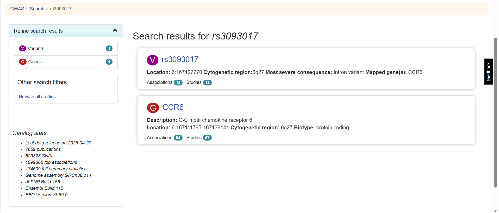

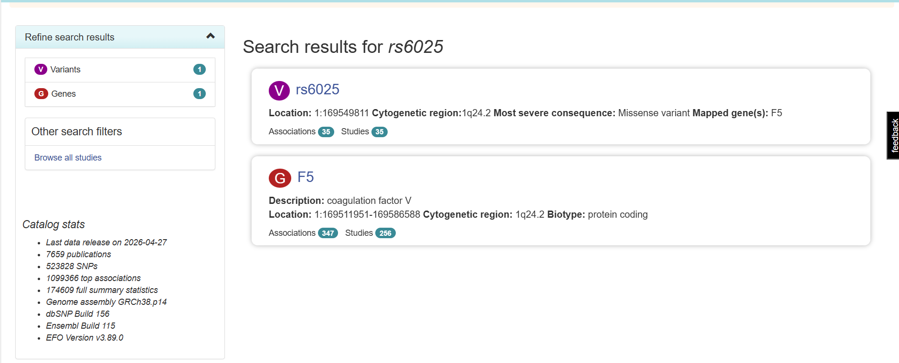

### Observed fields

Trait, risk allele, p-value, effect size, mapped gene, RAF, publication, study accession.

### Takeaway

GWAS Catalog dùng để lấy SNP-trait association ở mức research evidence, không phải chẩn đoán cá nhân.

## 4. ClinPGx / PharmGKB / CPIC / PharmCAT

### Search mode

Tra bằng `rsID`, gene, drug hoặc phenotype.

### Results

| rsID | Result |
| --- | --- |
| `rs3093017` | No results matched your query. |
| `rs6025` | Có variant result trong gene `F5`; có label annotations, summary annotation và variant annotations. Có allele/haplotype reference `C` và Factor V Leiden `T`. Một số annotation liên quan hormonal contraceptives, venous thrombosis / venous thromboembolism, stroke, antithrombotic agents, asparaginase, ace inhibitors / angiotensin II antagonists và angioedema. |
| `rs12562034` | No results matched your query. |

### Screenshots

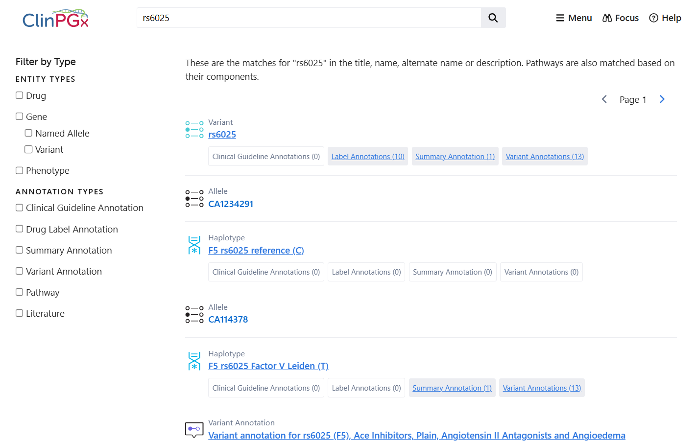

### Observed fields

Variant, allele/haplotype, drug, phenotype/condition, genotype/allele-specific association, annotation type, evidence level, label annotation, summary annotation, variant annotation.

### Takeaway

ClinPGx phù hợp cho pharmacogenomics/drug-response insight, không phải database bệnh tổng quát. Cần xét drug, phenotype, genotype/allele và evidence level.

## 5. SNPedia

### Search mode

Tra bằng `rsID` hoặc genotype-specific page.

### Results

| rsID | Result |
| --- | --- |
| `rs3093017` | Không có kết quả. |
| `rs6025` | Có page `Rs6025` và các genotype page như `Rs6025(A;A)`, `Rs6025(A;G)`, `Rs6025(G;G)`. Page mô tả Factor V Leiden/R506Q trong gene `F5`, có genotype-specific magnitude và risk summary. |
| `rs12562034` | Không có kết quả. |

### Screenshots

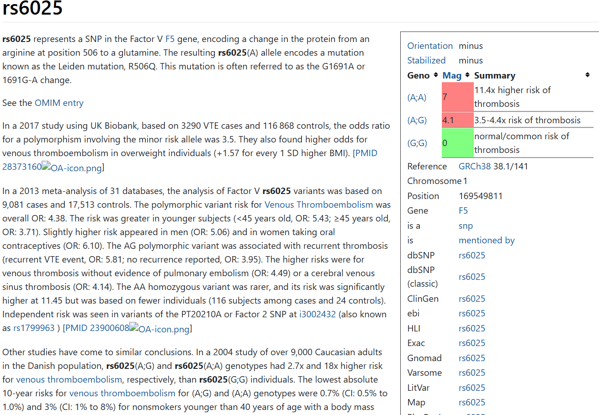

### Observed fields

Orientation, stabilized orientation, genotype summary, magnitude, chromosome-position, gene, GMAF, link sang dbSNP/ClinVar/gnomAD/LitVar/GWAS Catalog, PMID/literature summary.

### Takeaway

SNPedia hữu ích như nguồn phụ kiểu consumer genomics/literature summary, nhưng evidence không đồng đều và cần cẩn thận với strand/orientation.

## 6. gnomAD

### Search mode

Tra bằng `rsID` có thể dẫn tới trang variant trong gnomAD, nhưng bản chất gnomAD làm việc tốt nhất với variant đã chuẩn hóa theo `chromosome-position-ref-alt` trên genome build cụ thể, ví dụ GRCh38.

### Results

| rsID | Result |
| --- | --- |
| `rs3093017` | Có variant `6-167127770-C-G` trên GRCh38. Dataset gnomAD v4.1.1. Có trong genomes, không có data exomes. Filter `Pass`. Allele Count 92018, Allele Number 152062, Allele Frequency 0.6051, Number of homozygotes 28110. Có external resources như dbSNP, UCSC, ClinGen Allele Registry và All of Us. VEP cho thấy variant intron trong/near gene `CCR6`; có in silico predictors như CADD 1.20, SpliceAI 0.00, Pangolin 0.0100, phyloP -0.183. |
| `rs6025` | Có variant `1-169549811-C-T` trên GRCh38. Dataset gnomAD v4.1.1. Có trong cả exomes và genomes. Filter `Pass`, tổng thể có ghi `Discrepant frequencies`. Allele Count 34574, Allele Number 1613166, Allele Frequency 0.02143, Number of homozygotes 450. Có external resources như dbSNP, UCSC, ClinVar Variation ID 642, ClinGen Allele Registry và All of Us. VEP cho thấy missense variant trong gene `F5`, protein effect `Arg534Gln`, coding change `c.1601G>A`. Có in silico predictors như CADD 27.9, Pangolin -0.0400, phyloP 8.86, PolyPhen max 0.950. GnomAD cũng hiển thị ClinVar context: germline classification `drug response`, review status `reviewed by expert panel (3 stars)`, release ClinVar May 3, 2026. |
| `rs12562034` | Có variant `1-833068-G-A` trên GRCh38. Dataset gnomAD v4.1.1. Có trong genomes, không có data exomes. Filter `Pass`. Allele Count 17920, Allele Number 151546, Allele Frequency 0.1182, Number of homozygotes 1605. Có external resources như dbSNP, UCSC, ClinGen Allele Registry và All of Us. VEP cho thấy intron variant trong gene `LINC01128`; có in silico predictors như CADD 1.24, Pangolin 0.0200, phyloP -0.411. |

### Screenshots

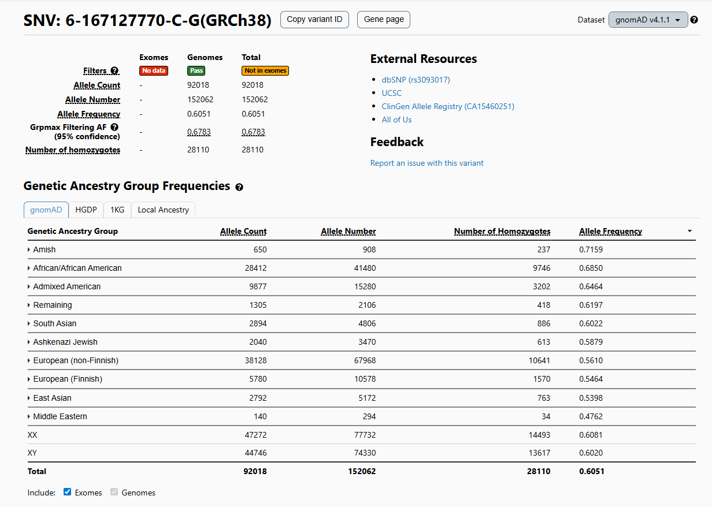

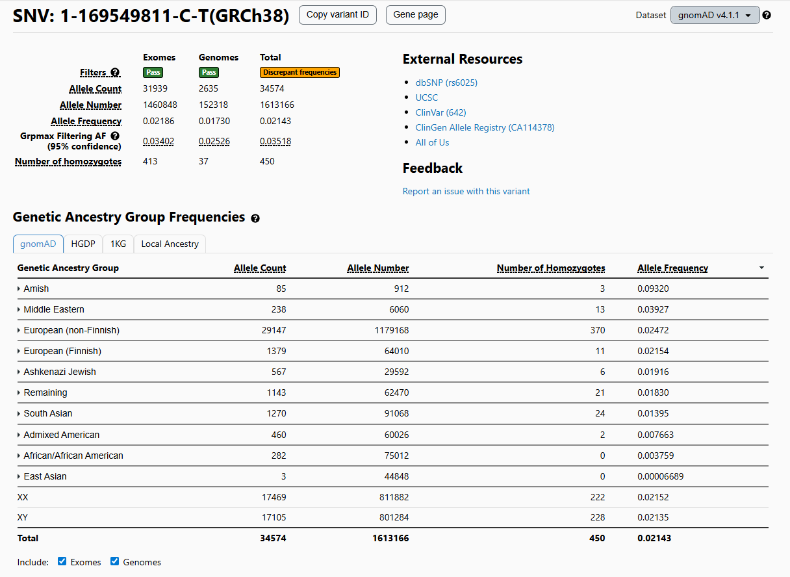

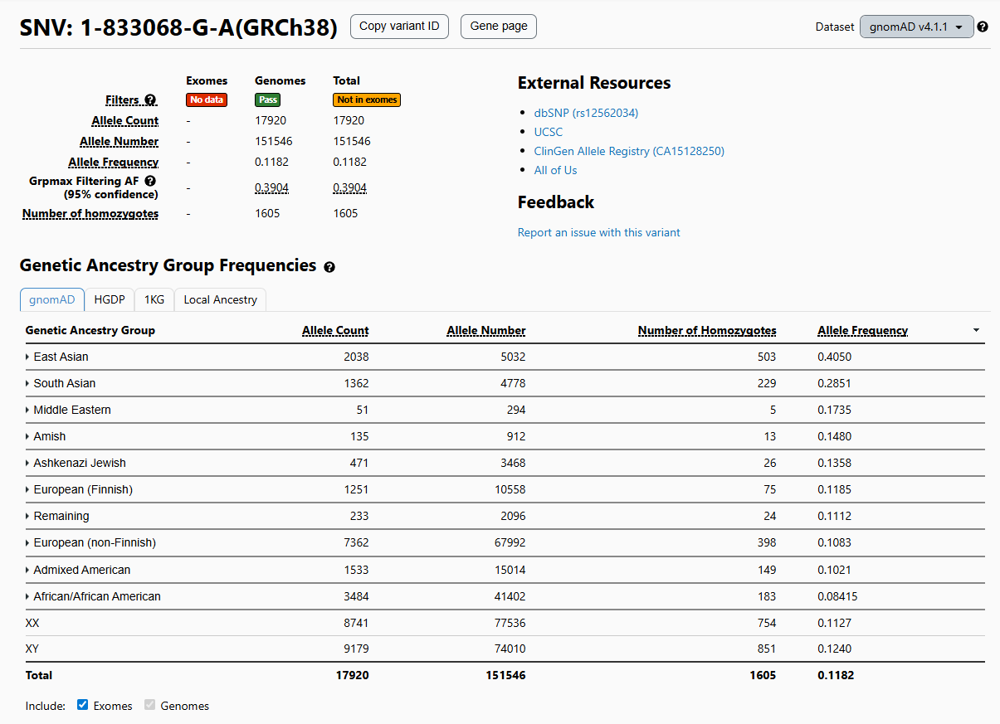

### Observed fields

Variant ID theo `chromosome-position-ref-alt`, genome build, dataset version, exome/genome availability, filter status, allele count, allele number, allele frequency, group/population frequencies, number of homozygotes, external resource links, VEP consequence, gene/transcript, HGVS cDNA/protein notation nếu có, in silico predictors, regional constraint, quality metrics và đôi khi có ClinVar summary.

### Takeaway

gnomAD phù hợp để kiểm tra population allele frequency, độ phổ biến/hiếm của biến thể trong nhiều nhóm quần thể, homozygote count và một số annotation kỹ thuật như consequence/predictor/constraint. Đây không phải clinical database và không nên dùng để kết luận bệnh lý; với input consumer SNP file, nên chuẩn hóa `rsID` sang `chromosome-position-ref-alt` và genome build trước khi join với gnomAD.

## 7. OMIM

### Search mode

Tra bằng `rsID` có thể trả về gene entry nếu rsID được OMIM index trong nội dung gene/allelic variant. Tuy nhiên, OMIM phù hợp hơn để tra theo gene, phenotype hoặc disease thay vì annotate hàng loạt SNP từ consumer DNA file.

### Results

| rsID | Result |
| --- | --- |
| `rs3093017` | Không có kết quả. OMIM gợi ý search alternative `rs3093077`. |
| `rs6025` | Có 1 entry: `*612309. COAGULATION FACTOR V; F5`, có `FACTOR V LEIDEN, INCLUDED`. Entry có cytogenetic location `1q24.2`, genomic coordinates trên GRCh38 `1:169,511,951-169,586,481`, matching term `rs6025`, Gene-Phenotype Relationships, ICD+, links và nhiều external resources. Khi mở entry, OMIM mô tả gene `F5`, chức năng coagulation factor V, các phenotype liên quan như thrombophilia due to factor V Leiden, activated protein C resistance, Budd-Chiari syndrome, ischemic stroke susceptibility, recurrent pregnancy loss susceptibility và factor V deficiency. Phần allelic variant có `612309.0001` cho Factor V Leiden / `F5, ARG506GLN`. |
| `rs12562034` | Không có kết quả và không có alternative search suggestion. |

### Screenshots

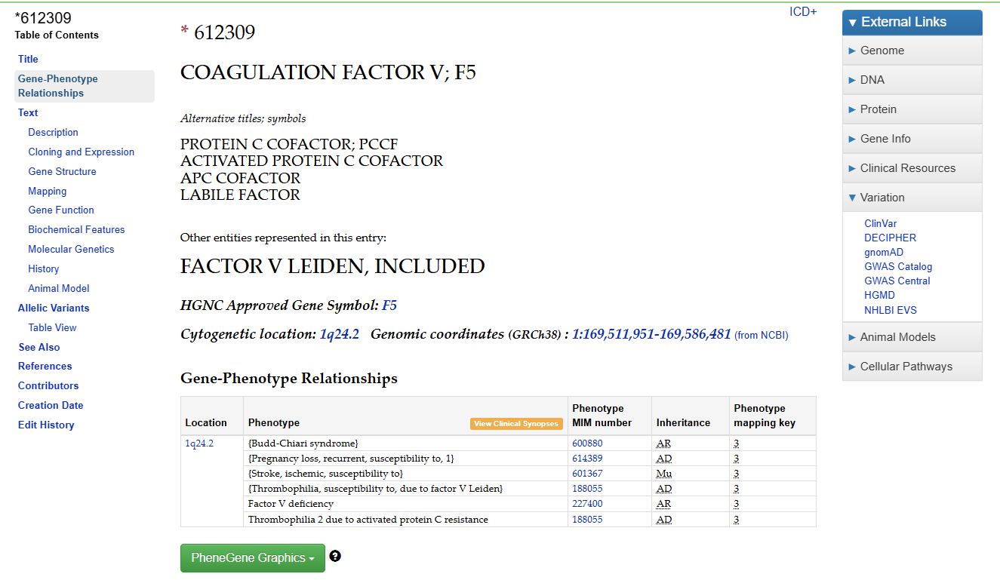

### Observed fields

OMIM number, gene symbol, alternative titles/symbols, cytogenetic location, genomic coordinates, gene-phenotype relationships, phenotype MIM number, inheritance, phenotype mapping key, description, molecular genetics, allelic variants, external links, references/PubMed.

### Takeaway

OMIM phù hợp để bổ sung ngữ cảnh gene-disease và Mendelian/clinical genetics cho gene hoặc variant có ý nghĩa rõ, ví dụ `F5` và Factor V Leiden. OMIM không phải database annotate SNP trực tiếp từ consumer SNP file; nhiều rsID phổ thông hoặc SNP GWAS sẽ không có kết quả. Cần dùng OMIM như nguồn giải thích gene/phenotype, không dùng để map đơn giản `rsID -> bệnh`.

## 8. ClinGen

### Search mode

ClinGen có các kiểu search như Gene Symbol, Gene Name, Disease Name, Drug Name, Region (GRCh37), Region (GRCh38), Variant và Website Content. Tuy nhiên, với mục tiêu test trực tiếp bằng 3 `rsID` mẫu, ClinGen không hoạt động giống một SNP lookup database thông thường. Search bằng gene symbol cũng không tương đương với việc kiểm tra một rsID cụ thể, nên không dùng gene search để kết luận rằng rsID đó có record.

### Results

| rsID | Result |
| --- | --- |
| `rs3093017` | Không ghi nhận được kết quả hữu ích khi test theo `rsID` trực tiếp trong ClinGen. |
| `rs6025` | Search theo `rsID` không cho một kết quả variant annotation rõ như ClinVar/dbSNP/GWAS Catalog. ClinGen search interface hiển thị các hướng tra cứu như Gene Symbol, Gene Name, Disease Name, Drug Name, Region (GRCh37/GRCh38), Variant và Website Content, nhưng search bằng gene symbol không phù hợp để đại diện cho test rsID. |
| `rs12562034` | Không ghi nhận được kết quả hữu ích khi test theo `rsID` trực tiếp trong ClinGen. |

### Observed fields

Gene Symbol, Gene Name, Disease Name, Drug Name, Region (GRCh37), Region (GRCh38), Variant, Website Content. Tùy loại record, ClinGen có thể cung cấp gene-disease validity, dosage sensitivity, expert panel curation, variant classification guidance hoặc curated clinical evidence.

### Takeaway

ClinGen nên được dùng như nguồn curated evidence cho gene-disease validity, dosage sensitivity và expert curation, không phải nguồn annotate SNP trực tiếp từ consumer SNP file. Với 3 rsID mẫu, không nên ép ClinGen vào mô hình `rsID -> result` giống dbSNP, ClinVar hoặc GWAS Catalog. Nếu cần dùng ClinGen trong MVP, nên dùng ở lớp giải thích gene/clinical validity hoặc lấy link evidence phụ, không dùng làm database tra hàng loạt rsID.

## 9. LitVar

### Search mode

Tra bằng `rsID` trong ô Variant, để trống Optional Text trong lần test đầu. LitVar normalizes các tên gọi khác nhau của cùng một variant và tìm các bài báo PubMed/PubMed Central có nhắc tới variant đó. Optional Text chỉ nên dùng ở lần lọc thứ hai nếu cần giới hạn theo disease/drug/keyword.

### Results

| rsID | Result |
| --- | --- |
| `rs3093017` | Có kết quả trong LitVar. Trả 16 publications, page đầu hiển thị 10/16 publications. Variant được hiển thị là `rs3093017`, gene/context gồm `CCR6, LOC107986672`, có ALFA Total MAF `G=0.471409/4699`, link sang dbSNP và ClinGen Identifiers. Các bài nổi bật liên quan rheumatoid arthritis / Mendelian randomization / functional genomics, ví dụ có PMID `39465724`, `34484118`, `35470158`, `39193017`, `34433485`. Một số snippet cho thấy variant được nhắc trong kết quả hoặc bảng/supplementary materials. |
| `rs6025` | Có kết quả rất nhiều trong LitVar. LitVar normalize query thành `c.1691G>A F5` / `rs6025 F5`. Trả 1690 publications, page đầu hiển thị 10/1690 publications. Variant summary có các tag như `benign`, `drug-response`, `risk-factor`, `pathogenic`, `conflicting-interpretations-of-pathogenicity`, ALFA Total MAF `T=0.022585/3828`, link sang dbSNP và ClinGen Identifier `CA114378`. Các bài nổi bật liên quan Factor V Leiden, thrombophilia, venous thromboembolism, preeclampsia, stroke, coronary/arterial/venous thrombosis. |
| `rs12562034` | Có kết quả trong LitVar theo test thủ công, dù không có record rõ trong ClinVar/GWAS Catalog. Chi tiết số lượng publications/normalized variant chưa được ghi lại trong note hiện tại. |

### Screenshots

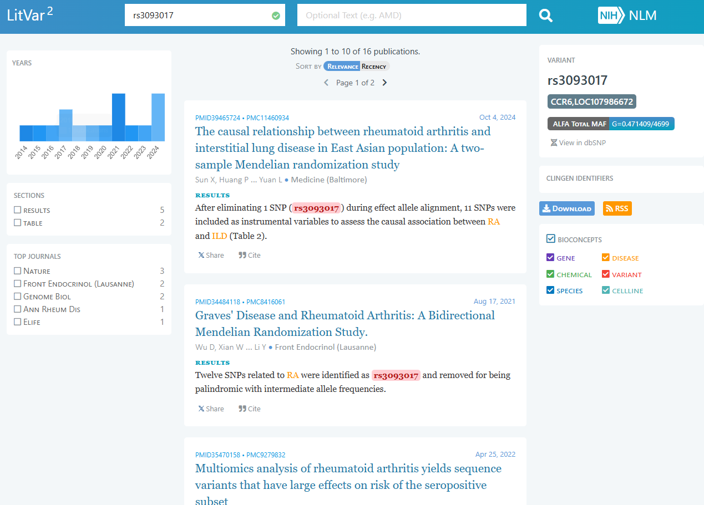

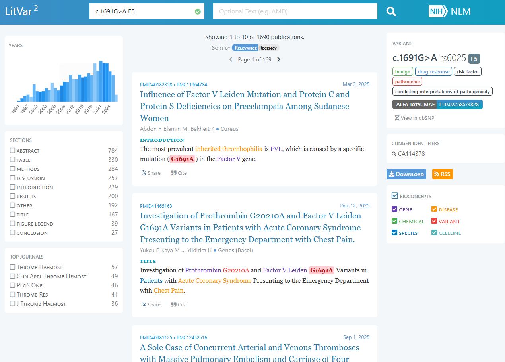

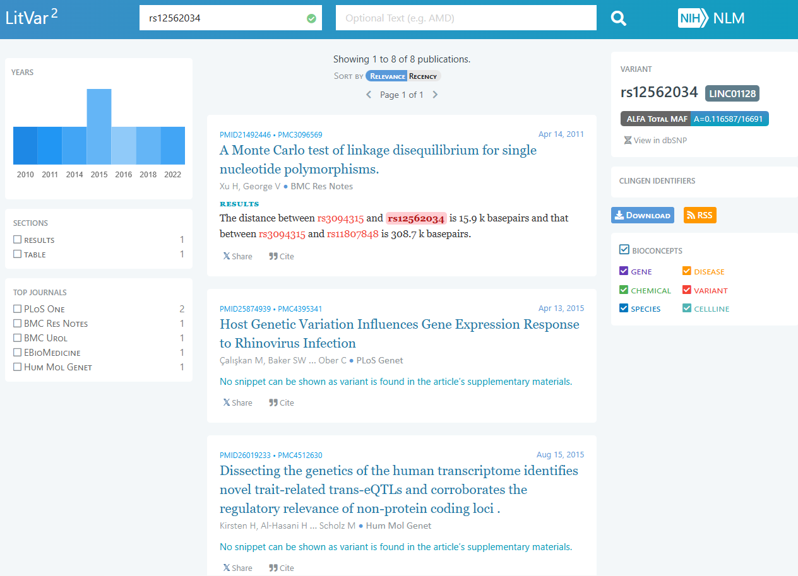

### Observed fields

Normalized variant name, rsID/gene context, number of publications, article sections where variant is mentioned, PubMed ID, PubMed Central ID, publication date, title, authors, journal, snippets, top journals, related BioConcepts, dbSNP link, ClinGen identifiers và ALFA MAF nếu có.

### Takeaway

LitVar hữu ích để truy vết literature evidence cho variant, kể cả những SNP không có record rõ trong clinical/association databases. Đây là nguồn literature mining, không phải clinical interpretation database. Có kết quả trong LitVar không đồng nghĩa variant có ý nghĩa lâm sàng; cần đọc paper context, kiểm tra variant được nhắc ở abstract/table/supplementary, và không dùng LitVar để kết luận `rsID -> bệnh`.

## Nhận xét tổng kết

Bộ test 3 rsID cho thấy cách các database phản ứng rất khác nhau với cùng một input. `rs6025` là biến thể có nhiều evidence nên xuất hiện ở nhiều nguồn, trong khi `rs3093017` chủ yếu hữu ích ở lớp GWAS/literature và `rs12562034` chủ yếu xác nhận được ở các nguồn định danh/tần suất như dbSNP, gnomAD hoặc literature mining. Vì vậy, coverage của database không nên được hiểu là chất lượng hoặc mức độ clinical relevance của variant.

Đối với MVP, nên ưu tiên luồng xử lý theo thứ tự: xác thực và chuẩn hóa rsID/genome build, gắn population frequency, sau đó mới bổ sung clinical significance, pharmacogenomics, GWAS association, gene-disease context và literature evidence nếu có. Giao diện cần thể hiện rõ nguồn dữ liệu, mức bằng chứng, ngày/version nếu có, và cảnh báo rằng các kết quả này chỉ hỗ trợ tham khảo/triage, không phải chẩn đoán hay khuyến nghị y khoa cá nhân.
